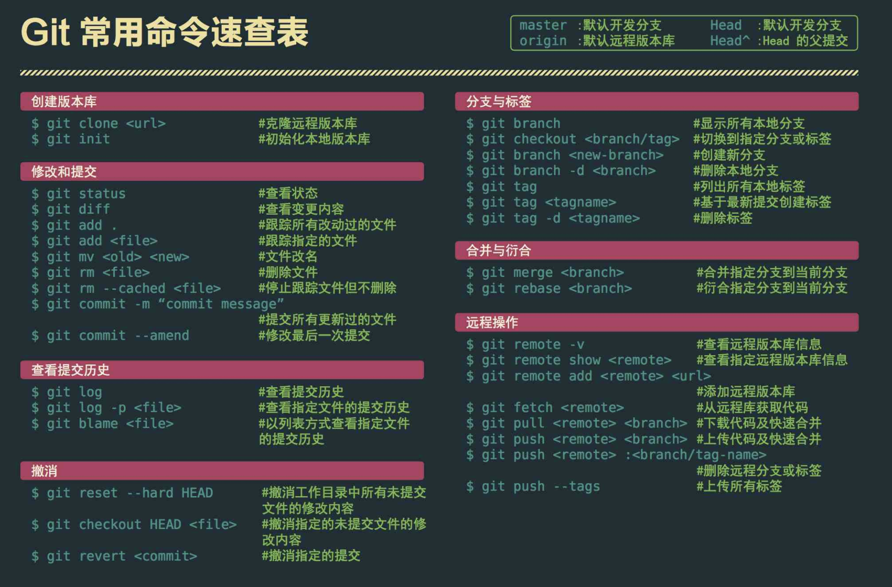
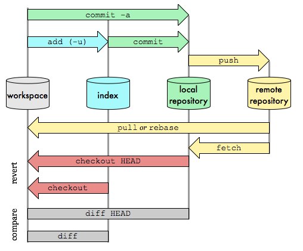
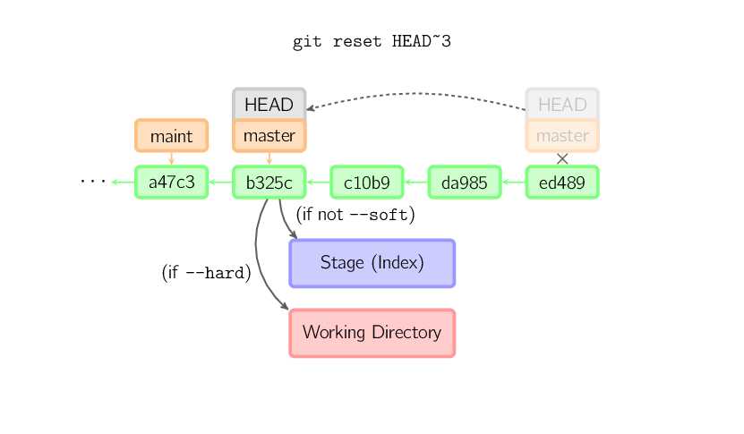

git干货集锦
=

* git 区域划分
    * Workspace：工作区
        * 程序员进行开发改动的地方，是你当前看到的，也是最新的。平常我们开发就是拷贝远程仓库中的一个分支，基于该分支进行开发。在开发过程中就是对工作区的操作。
    * Index / Stage：暂存区
        * .git目录下的index文件, 暂存区会记录git add添加文件的相关信息(文件名、大小、timestamp...)，不保存文件实体, 通过id指向每个文件实体。可以使用git status查看暂存区的状态。暂存区标记了你当前工作区中，哪些内容是被git管理的。当你完成某个需求或功能后需要提交到远程仓库，那么第一步就是通过git add先提交到暂存区，被git管理。
    * Repository：仓库区（或本地仓库）
        * 保存了对象被提交 过的各个版本，比起工作区和暂存区的内容，它要更旧一些。git commit后同步index的目录树到本地仓库，方便从下一步通过git push同步本地仓库与远程仓库的同步。
    * Remote：远程仓库
        * 远程仓库的内容可能被分布在多个地点的处于协作关系的本地仓库修改，因此它可能与本地仓库同步，也可能不同步，但是它的内容是最旧的。
    
* 名词解释
    * head 提交点 当所处分支变化或或者进行过新的提交后该点都会发生变化
    * branch 分支 每条不同的提交流程分别属于不同的分支，分支与分支之间的数据操作互不影响
        * 命令
            * git branch 列出所有本地分支
            * git branch -r 列出所有远程分支
            * git branch -a 列出所有本地分支和远程分支
            * git branch 新建一个分支，但依然停留在当前分支
            * git checkout -b 新建一个分支，并切换到该分支
            * git branch --track 新建一个分支，与指定的远程分支建立追踪关系
            * git checkout 切换到指定分支，并更新工作区
            * git branch -d 删除分支
            * git branch -f master [id]强制移动分支到指定位置
            * git push origin --delete 删除远程分支
    * merge 合并 分支合并，此操作会在当前分支后新增一个提交点以合并指定分支内容
        * git merge [] 将制定分支合并到当前分支
    * rebase 变基 分支合并，与merge不同的是rebase会把当前分支的所有提交点原封不动的平移到指定分支分支
        * git rebase []  把当前分支合并到指定分支上
        * 例如：指定分支内容  1 -> 2 -> 3 -> 4 当前分支内容 5 - > 6
        * merge  1 -> 2 -> 3 -> 4 -> 7
        * rebase 1 -> 2 -> 3 -> 4 -> 5' -> 6'
        * PS:rebase除了感觉内容会干净些会整齐些没发现其他的优点。缺点：当内容有冲突时，rebase需要处理所有节点的错误，例如有三个提交节点就要处理三次。merge 只需处理一次
        * 选择
            * 如果你想要一个干净的，没有merge commit的线性历史树，那么你应该选择git rebase
            * 如果你想保留完整的历史记录，并且想要避免重写commit history的风险，你应该选择使用git merge
         * 命令
            * git rebase -i 复制一些节点到新的分支上并切换分支
         * 交互式rebase
            * 交互式 rebase 指的是使用带参数 --interactive 的 rebase 命令, 简写为 -i
    * reset 回滚 reset会将head指向reset的位置，并不会进行新的节点的添加
        * git reset [] 回滚到指定位置
    
    * revert 提交式回滚 revert会将revert的位置进行提交，也就是会新生成一个内容与revert相同的节点
        * git revert [] 重新提交指定位置信息
    * cherry pick 
        * git cherry-pick [] 复制指定位置信息到本分支提交位置（复制几个地方，就提交几次）
    * clone 克隆 从Remote下载内容
    * pull 拉取 在已经存在Repository的情况下从远程库更新内容到本地库
    * push 推送 将Repository中的更新内容更新到远程库
        * git push 上传本地指定分支到远程仓库
        * git push --force强行推送当前分支到远程仓库，即使有冲突
        * git push --all推送所有分支到远程仓库
    * add 添加 将Workspace内需要添加git的文件放置于Index中
    * commit 提交 将Index中的文件提交到Repository
    