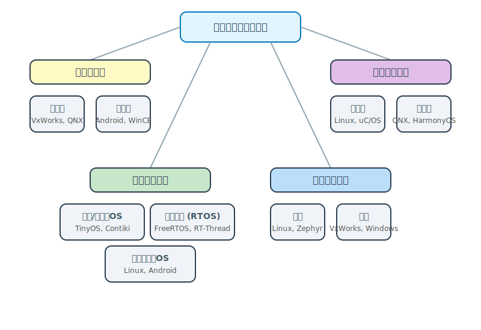
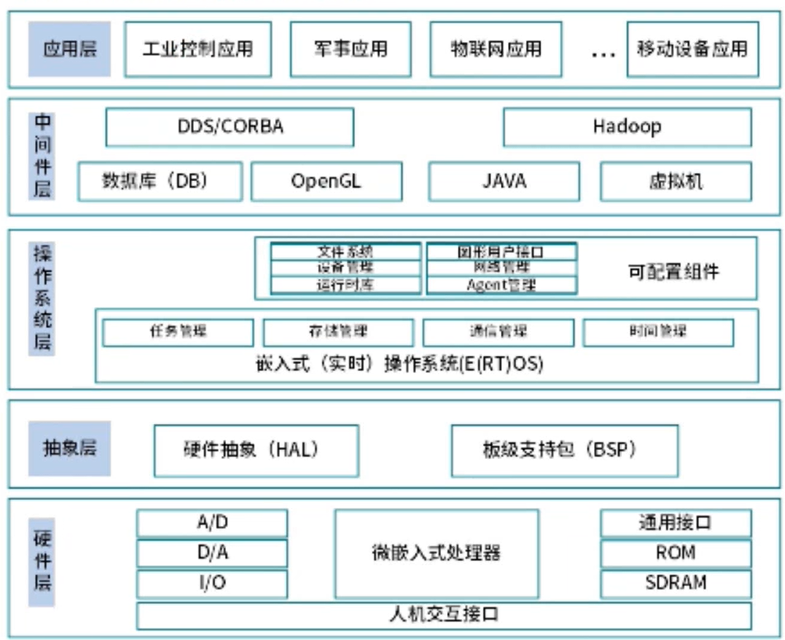
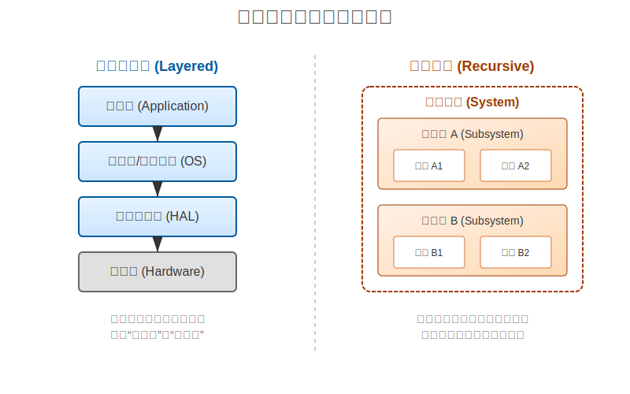
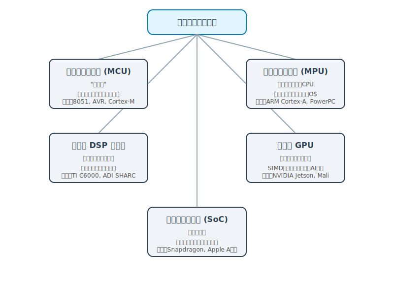
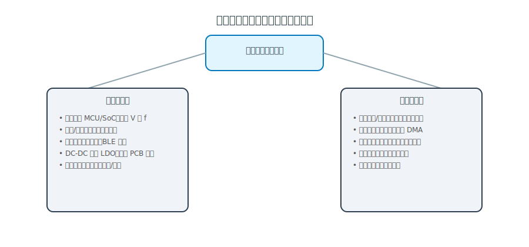
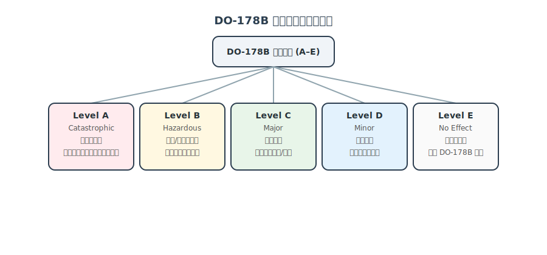
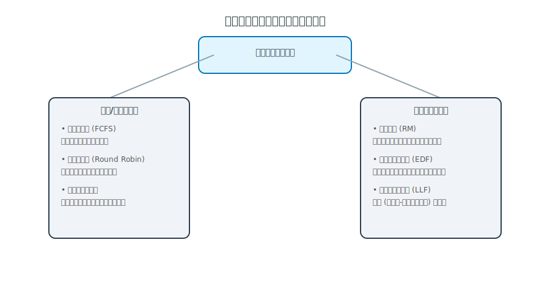

# 嵌入式

## 嵌入式系统概述

### 基本概念
嵌入式系统（Embedded System）是一种**以应用为中心**、**以计算机技术为基础**，并且**软硬件可裁剪**的专用计算机系统。
它主要用于满足应用系统对**功能、可靠性、成本、体积和功耗**等方面的严格要求。

### 核心特征
1.  **专用性强**：通常是为特定的应用场景或任务而设计的，不像通用计算机那样“什么都能干”。
2.  **嵌入性**：从计算机角度看，它是嵌入到各种设备（如汽车、机床、家电）内部的计算机系统。它作为被控设备的一个核心部件，隐藏在设备内部，用户通常感觉不到它的存在。
3.  **资源受限**：由于对体积、成本和功耗的严格限制，嵌入式系统的处理器性能、内存大小和存储空间通常比通用计算机要小得多。
4.  **高可靠性**：许多嵌入式系统（如医疗设备、汽车刹车系统）需要长时间稳定运行，对可靠性要求极高。

### 系统组成
一般而言，嵌入式系统由以下四大部分组成：

1.  **嵌入式处理器**：系统的“大脑”，如单片机 (MCU)、数字信号处理器 (DSP)、嵌入式微处理器 (MPU) 或片上系统 (SoC)。
2.  **相关支撑硬件**：包括存储器（Flash, RAM）、外设接口（GPIO, UART, I2C）、传感器和执行器等。
3.  **嵌入式操作系统 (EOS)**：负责管理硬件资源和调度任务。根据实时性要求，可分为实时操作系统 (RTOS，如 VxWorks, FreeRTOS) 和分时操作系统 (如 Linux, Android)。
4.  **应用软件**：运行在操作系统之上的特定功能软件，实现具体的控制逻辑或业务功能。

> **Tags**: #嵌入式系统 #基本概念 #系统组成 #专用计算机

## 嵌入式中的混成系统

通俗来讲，嵌入式中的混成系统是指同时包含连续动态行为和离散事件行为的系统。连续动态行为通常是指随时间连续变化的物理过程，比如温度、速度、压力等的变化；而离散事件行为则是指那些突然发生的、状态会产生跳跃变化的事件，比如开关的闭合与断开、传感器的触发等。混成系统就是将这两种不同类型的行为结合在一起，相互作用、协同工作。

举个简单的例子，汽车的自动巡航控制系统就是一个典型的混成系统。在这个系统中，连续动态行为表现为汽车的速度随时间连续变化，受到发动机的驱动力、空气阻力、路面摩擦力等因素的影响。而离散事件行为则包括驾驶员按下巡航开启/关闭按钮、设置巡航速度、踩下刹车等操作。当驾驶员按下巡航开启按钮（离散事件），系统会进入巡航状态，开始根据当前车速与设定车速的偏差，连续地调整发动机的输出功率（连续动态行为），以保持车速稳定；当驾驶员踩下刹车（离散事件），巡航系统会立即退出工作状态。
## 嵌入式操作系统分类

嵌入式操作系统（EOS）种类繁多，通常可以从**实时性、内核结构、应用规模**等维度进行分类。

### 1. 按实时性分类 (Real-time Performance)
在嵌入式系统中，实时操作系统可分为弱实时操作系统和强实时操作系统：

*   **强实时操作系统 (Hard RTOS)**
    *   **定义**：必须在严格的时间约束内完成任务，任何超出时限的延迟都可能导致系统故障甚至危及安全。
    *   **应用**：航空航天、工业控制、医疗设备。
    *   **示例**：
        *   **VxWorks**：广泛应用于航空航天（如火星探测器）、工业控制。
        *   **QNX**：微内核架构，常用于汽车电子（车机、仪表盘）、工业自动化。

*   **弱实时操作系统 (Soft RTOS)**
    *   **定义**：对任务的响应时间要求相对宽松，允许在一定范围内有延迟，不会因为偶尔的延迟而导致系统出现严重问题。
    *   **应用**：消费电子、智能手机、机顶盒。
    *   **示例**：
        *   **Android / Linux**：虽然具备一定的实时性扩展（如 PREEMPT_RT），但主要侧重于吞吐量和用户体验，而非确定性的硬实时响应。
        *   **Windows CE**：微软推出的嵌入式系统，曾广泛用于PDA和工业手持设备。

### 2. 按应用规模分类 (Application Scale)
根据系统的资源占用和功能复杂度，EOS 可分为以下几类：

*   **微型/传感器操作系统 (Sensor OS)**
    *   **特点**：体积极小（KB级），针对资源极度受限（如 8位/16位 MCU，几KB RAM）的无线传感器节点。
    *   **示例**：**TinyOS**, **Contiki**。
*   **实时内核 (RTOS Kernel)**
    *   **特点**：主要提供多任务调度、同步互斥、中断管理等基础功能，通常不带文件系统和GUI，体积小（几十KB）。
    *   **示例**：**FreeRTOS**, **RT-Thread Nano**, **uC/OS-II/III**。
*   **全功能通用操作系统 (General Purpose EOS)**
    *   **特点**：功能强大，具备完整的文件系统、GUI、网络协议栈、内存管理，支持复杂的应用程序，通常运行在 32/64位 MPU/SoC 上。
    *   **示例**：**Embedded Linux**, **Android**, **Windows IoT**。

### 3. 按内核结构分类 (Kernel Structure)
*   **宏内核 (Monolithic Kernel)**：所有系统服务（文件系统、驱动、协议栈）都集成在内核态，性能高但耦合度高。（如 Linux）
*   **微内核 (Microkernel)**：内核只保留最基本的调度和IPC功能，其他服务运行在用户态，稳定性高但通信开销大。（如 QNX, HarmonyOS）
*   *(详见后文“内核架构：宏内核与微内核的区别”章节)*

> **Tags**: #嵌入式操作系统 #RTOS #分类 #内核架构

## 嵌入式系统架构

## 内核架构：宏内核与微内核的区别

在嵌入式系统的内核架构中，宏内核（Monolithic Kernel）和微内核（Microkernel）是两种常见且特性迥异的设计模式，下面从多个方面介绍它们的区别：

### 结构设计
- **宏内核**：将操作系统的主要功能模块，如进程管理、内存管理、文件系统、设备驱动等都集成在一个内核空间中。整个内核是一个完整的可执行程序，模块之间可以直接调用，结构紧凑。
- **微内核**：只把最基本的功能（如进程调度、内存管理基础、进程间通信等）放在内核空间，而其他功能模块（如文件系统、设备驱动等）则作为用户进程运行。各模块之间通过消息传递机制进行通信。

### 性能表现
- **宏内核**：由于模块间直接调用，减少了用户态和内核态之间的切换开销，因此在性能上通常具有较高的执行效率，系统响应速度快。
- **微内核**：模块间通过消息传递通信，增加了额外的开销，性能相对较低。不过，这种设计使得系统的并发处理能力更强，各模块可以独立运行。

### 可维护性与可扩展性
- **宏内核**：因为所有模块紧密集成，修改或添加一个模块可能会影响到其他模块，导致系统的可维护性和可扩展性较差。一旦内核出现问题，可能会导致整个系统崩溃。
- **微内核**：各模块独立运行，修改或添加一个模块不会影响其他模块，系统的可维护性和可扩展性较好。当某个模块出现问题时，不会影响整个系统的运行，系统的可靠性更高。

### 应用场景
- **宏内核**：适用于对性能要求较高、功能相对固定的嵌入式系统，如一些工业控制、实时监控系统等。Linux 内核就是宏内核的典型代表。
- **微内核**：适用于对系统可靠性和可扩展性要求较高的场景，如航空航天、医疗设备等对安全要求极高的嵌入式系统。QNX 是微内核的典型代表。

## 嵌入式数据库分类

在嵌入式系统中，数据库可根据存储和访问方式分为文件数据库、内存数据库和网络数据库，以下是具体介绍及举例：

### 文件数据库
文件数据库将数据存储在文件系统中，以文件的形式对数据进行管理。这种数据库适合对数据持久化存储有需求，且数据量相对较小、访问频率不高的场景。
- **SQLite**：一款轻量级的文件数据库，具有零配置、无需服务器、占用资源少等特点。广泛应用于移动设备（Android/iOS）、嵌入式设备。
- **Berkeley DB**：Oracle 提供的嵌入式键值数据库，支持高并发和事务处理。

### 内存数据库
内存数据库将数据存储在内存中，通过内存来实现数据的快速读写，因此具有极高的访问速度。它适用于对数据读写速度要求极高、需要实时处理数据的场景。
- **Redis**：虽然常用于服务器端缓存，但其轻量级版本也可用于高性能嵌入式系统。
- **eXtremeDB**：专为实时嵌入式系统设计的内存数据库，具有微秒级的响应速度，常用于航空航天和金融交易。

### 网络数据库
网络数据库通过网络进行数据的存储和访问，数据存储在远程服务器上，客户端通过网络请求与数据库进行交互。这种数据库适合需要多设备共享数据、数据量较大的场景。
- **Couchbase Lite**：Couchbase 的嵌入式版本，支持离线优先（Offline First）架构。设备离线时数据存本地，在线时自动与云端同步。

## 嵌入式系统的典型架构模式

大多数嵌入式系统都具备实时特征，其典型架构可概括为**层次化模式**和**递归模式**两种。

### 1. 层次化模式 (Layered Pattern)

层次化模式通过将系统划分为若干个层次，高层抽象概念依赖于底层具体概念来实现。这种模式有助于降低系统的耦合度，提高可维护性。

*   **基本结构**：通常包括硬件层、硬件抽象层 (HAL)、操作系统/中间件层、应用层。
*   **两种类型**：
    *   **封闭型 (Closed)**：一层中的对象只能调用其**直接下层**提供的接口。
        *   *优点*：依赖关系清晰，可维护性强，移植性好。
        *   *缺点*：因为需要层层传递，性能开销较大。
    *   **开放型 (Open)**：一层中的对象可以调用**其下任何一层**提供的接口。
        *   *优点*：减少了中间调用环节，性能较好。
        *   *缺点*：破坏了封装性，层级依赖混乱，导致移植和维护困难。

### 2. 递归模式 (Recursive Pattern)

递归模式适用于非常复杂的系统，解决的是如何将一个复杂系统分解为可管理的子系统，并确保这种分解过程是可扩展的。

*   **核心思想**：利用“包含”关系，将系统视为由若干子系统组成，每个子系统又可以进一步分解为更小的子系统或组件。这种结构类似于“俄罗斯套娃”。
*   **开发流程**：
    *   **自顶向下 (Top-Down)**：从系统层级开始，识别出实现协作的子系统，逐步细化抽象层级，直到具体的组件。
    *   **自底向上 (Bottom-Up)**：从现有的组件开始，组合成子系统，再组合成更大的系统。
*   **优点**：
    *   **应对复杂性**：通过层层分解，将巨型系统拆解为可控的小单元。
    *   **可验证性**：在每一步细化过程中，都可以对系统进行可靠性和实时性的验证。
    *   **并行开发**：不同的子系统可以独立开发和测试。

## 嵌入式微处理器分类

嵌入式处理器是嵌入式系统的核心部件。根据**功能定位、集成度及应用场景**的不同，通常将嵌入式处理器分为以下五大类：

### 1. 嵌入式微控制器 (MCU)
*   **别名**：单片机 (Single Chip Microcomputer)。
*   **特点**：
    *   **高度集成**：将 CPU、存储器（RAM/ROM）、I/O 接口、定时器、ADC/DAC 等外设全部集成在同一块芯片上。
    *   **体积小、功耗低、成本低**：非常适合对成本和功耗敏感的控制类应用。
    *   **“单片”**：外部通常只需要很少的辅助电路（如晶振、电源）即可工作。
*   **典型应用**：家电控制（洗衣机、微波炉）、工业仪表、汽车电子（车窗控制、雨刮器）、玩具等。
*   **代表芯片**：8051 系列、AVR 系列、ARM Cortex-M 系列 (STM32)。

### 2. 嵌入式 DSP 处理器 (DSP)
*   **全称**：数字信号处理器 (Digital Signal Processor)。
*   **特点**：
    *   **擅长运算**：专门为快速实现各种数字信号处理算法（如滤波、FFT）而设计。
    *   **哈佛结构**：通常采用哈佛结构（程序和数据存储分开），拥有独立的硬件乘法器和专门的指令集，能在一个指令周期内完成多次乘加运算。
*   **典型应用**：音频/视频处理、通信基站、雷达声纳、医学成像等需要大量数学运算的领域。
*   **代表芯片**：TI 的 TMS320 系列、ADI 的 SHARC 系列。

### 3. 嵌入式微处理器 (MPU)
*   **全称**：Micro Processor Unit。
*   **特点**：
    *   **高性能**：由通用的计算机 CPU 演变而来，保留了与通用 CPU 相似的功能，但针对嵌入式应用进行了优化（如减小体积、降低功耗）。
    *   **功能单一**：通常只包含 CPU 内核和少量的外设接口，**不集成**大容量的存储器（RAM/ROM）。因此，设计系统时需要外接存储器和 I/O 电路。
    *   **运行复杂 OS**：通常用于运行功能强大的操作系统（如 Linux, Windows CE, Android）。
*   **典型应用**：智能手机、平板电脑、路由器、工业控制主机等。
*   **代表芯片**：ARM Cortex-A 系列、PowerPC、MIPS。

### 4. 嵌入式图形处理器 (GPU)
*   **全称**：Graphics Processing Unit。
*   **特点**：
    *   **高并行度**：拥有成百上千个核心，非常适合处理并行计算任务。
    *   **SIMD 架构**：单指令多数据流，擅长处理图像、视频等大规模数据。
    *   **异构计算**：常与 CPU 协同工作，处理 AI 推理、图像识别等计算密集型任务。
*   **典型应用**：智能驾驶、安防监控、无人机、游戏机、VR/AR 设备。
*   **代表芯片**：NVIDIA Jetson 系列、ARM Mali、Imagination PowerVR。

### 5. 嵌入式片上系统 (SoC)
*   **全称**：System on Chip。
*   **特点**：
    *   **极高集成度**：在单一芯片上集成了一个完整的系统。它不仅包含处理器内核（可能是 MCU、MPU 或 DSP），还集成了大量的硬件加速器、通信接口、甚至模拟电路和射频模块。
    *   **软硬件协同设计**：SoC 的设计不再仅仅是硬件的堆叠，而是软硬件协同设计的结果。
    *   **定制化**：往往是针对特定的应用领域（如手机 SoC、机顶盒 SoC）进行专门设计的。
*   **典型应用**：智能手机（如高通骁龙、苹果 A 系列）、智能电视、复杂的物联网终端。
*   **代表芯片**：Qualcomm Snapdragon, Apple A-Series, Huawei Kirin.

> **Tags**: #嵌入式处理器 #MCU #DSP #MPU #GPU #SoC #分类

## 嵌入式系统功耗设计：软硬件两个方面

在嵌入式系统中，功耗往往是**一等公民**问题：很多设备依赖电池供电（传感器节点、可穿戴设备、物联网终端），或者需要控制发热与能效（工业控制、车载系统）。功耗优化需要**软硬件协同设计**，可以从以下两个方面来考虑：

### 一、硬件层面的功耗设计

1.  **器件选型与工艺**
    *   选择**低功耗 MCU/SoC**：例如带有多级低功耗模式（Sleep/Stop/Standby）的 Cortex-M 系列。
    *   优先采用**低电压、先进工艺节点**的芯片，降低静态功耗和动态功耗。
2.  **电源与时钟架构**
    *   合理规划**电源域与时钟域**，把可关闭的模块放在独立电源/时钟域，便于整体关断。
    *   支持 **DVFS（动态电压频率调节）** 的芯片可以根据负载调节频率与电压，轻载时降频省电。
3.  **外设与通信接口**
    *   对于无线通信，优先选择**低功耗协议**（如 BLE、Sub-GHz）而不是长时间在线的 Wi-Fi。
    *   选择待机电流低的传感器、存储器、模拟器件，并关注其睡眠模式下的电流指标。
4.  **板级电源设计**
    *   适当使用 **DCDC（开关电源）** 替代 LDO，在压差较大、负载较重场景显著降低损耗。
    *   合理设置上拉/下拉电阻，避免无谓的漏电流；优化 PCB 走线与地线，降低噪声和浪费。

### 二、软件层面的功耗优化

1.  **充分利用低功耗模式**
    *   避免长时间空转，让 CPU 尽可能多地处于 **Sleep/Deep Sleep/Standby** 等低功耗状态。
    *   合理配置唤醒源（定时器中断、外部中断、通信事件），做到“用完即睡”。
2.  **中断驱动与 DMA**
    *   尽量用**中断驱动**代替轮询：例如串口、I2C 接收采用中断而不是 while 轮询。
    *   使用 **DMA** 搬运数据（如 ADC 采样、通信收发），减少 CPU 参与次数，缩短活跃时间。
3.  **算法与代码优化**
    *   选择计算量更小的算法：例如在满足精度前提下，用**定点算法**替代浮点运算。
    *   减少不必要的内存访问和缓存失效，避免频繁访问外部 Flash/SD 卡等高能耗存储。
4.  **外设与通信的功耗管理**
    *   不使用的外设及时关闭：关掉不必要的时钟源、外围模块（如未用的 ADC、定时器、串口）。
    *   对无线模块采用**低占空比策略**：集中发送/接收数据后立即关闭射频前端。
5.  **任务调度与系统负载**
    *   合理安排任务周期：把高频但非刚需的任务“降频”，避免频繁唤醒系统。
    *   对实时性要求不高的任务进行批处理，减少唤醒次数，从“频繁少量”变为“集中一批”。

总体思路可以概括为：  
**硬件上“选好料、分好域”，软件上“少干活、快睡觉”**，再辅以测量工具（电流计、功耗分析仪）闭环验证，才能把功耗真正压下来。

> **Tags**: #嵌入式系统 #功耗设计 #低功耗硬件 #低功耗软件 #软硬件协同

## 航空安全标准示例：DO-178B

DO-178B（《机载系统与设备认证中的软件考虑》）是民用航空电子软件的安全标准，可以简单理解为：想让软件“上飞机并安全飞行”，就必须按照它规定的过程来开发和验证。

### 1. 适用范围与核心目标

*   **适用对象**：飞机上的飞行控制、导航、显示、发动机控制等航空电子软件。
*   **核心问题**：
    *   软件会不会出错？
    *   出错之后，对飞行安全会有什么级别的影响？

### 2. 软件等级（Level A–E）

DO-178B 按**失效后果**将软件分为 5 个等级：

**Level A – Catastrophic（灾难级）**：失效可能导致飞机毁损、多名人员伤亡（例如主飞控）。
**Level B – Hazardous（危险级）**：严重影响飞行安全，可能造成人员严重伤害。
**Level C – Major（重大）**：明显影响任务/安全，但一般不会导致灾难性后果。      
**Level D – Minor（轻微）**：仅轻微影响，主要是增加机组工作量。
**Level E – No Effect（无影响）**：对飞行安全无影响，不受 DO-178B 约束。

## 嵌入式实时操作系统的典型调度算法

在嵌入式实时操作系统（RTOS）中，调度算法的目标是：在资源有限的前提下，让关键任务**按时、可靠地完成**。下面从 6 种常见调度算法来理解它们各自的思路、优缺点和典型应用场景。

### 1. 优先级抢占调度

*   **核心思想**：给每个任务分配优先级，**高优先级任务可以随时打断（抢占）低优先级任务**，获得 CPU 使用权。
*   **适用场景**：对某些任务响应时间要求非常严格的**强实时系统**，例如飞控系统、汽车安全气囊控制等。
*   **优点**：
    *   对高优先级任务的响应时间可控，便于做“最坏情况响应时间”分析。
*   **缺点**：
    *   存在“**优先级反转**”问题，需要结合优先级继承等机制来缓解。

### 2. 时间片轮转调度

*   **核心思想**：把 CPU 时间切成一个个长度相同的**时间片**，就像排队轮流办事一样，**每个就绪任务依次获得一个时间片**，时间片用完就让出 CPU，轮到下一个任务。
*   **适用场景**：对**公平性和吞吐量**有要求、但实时性要求相对不那么苛刻的场景，例如一般的嵌入式终端、简单人机交互系统。
*   **优点**：
    *   实现简单，任务间相对公平，不会出现某个任务长期得不到运行机会。
*   **缺点**：
    *   对严格实时的任务难以给出确定的截止时间保证。
    *   时间片过大影响响应，过小则上下文切换开销大。

### 3. 速率单调调度（RM，Rate Monotonic）

*   **核心思想**：**周期越短的任务，优先级越高**。这是一个经典的**固定优先级**调度算法，适用于处理一组周期性任务。
*   **适用场景**：周期性控制任务较多、任务之间相对独立的强实时系统，例如电机控制、周期采样和闭环控制系统。
*   **优点**：
    *   理论上可进行可调度性分析，能够判断“这组周期任务在 RM 下是否一定能按时完成”。
    *   优先级静态配置，运行时开销小，实现简单。
*   **缺点**：
    *   只对**周期性任务**效果好，对非周期任务和动态任务集不够灵活。
    *   调度利用率存在上限（任务数越多，总 CPU 利用率上限越低）。

### 4. 最早截止时间优先调度（EDF，Earliest Deadline First）

*   **核心思想**：**谁的截止时间最近，谁的优先级最高**。每当任务状态变化时，根据当前剩余截止时间动态调整任务优先级，是一种**动态优先级**调度算法。
*   **适用场景**：有明确截止时间约束的任务集，包含周期任务与部分非周期任务的强实时或硬实时系统。
*   **优点**：
    *   在理论上，只要总负载不超过 100%，就能保证所有任务按时完成，CPU 利用率高。
*   **缺点**：
    *   实现复杂度高，需要频繁更新任务优先级。
    *   在实际工程中要考虑任务切换开销和时钟精度。

### 5. 扫描调度（SCAN）

*   **核心思想**：原本用于磁盘调度，可推广为：**按照某个方向依次“扫描”任务队列**，在当前扫描方向上尽量一次性处理完可执行任务，减少反复来回切换。
*   **适用场景**：任务在某个有序空间上排队（例如 I/O 请求、轮询多个通道），希望**减少来回寻址或切换开销**的场合。
*   **优点**：
    *   相比简单的“最短寻道优先”等策略，更加平衡，避免频繁在两端来回摆动。
*   **缺点**：
    *   严格实时性保证较弱，更偏向“性能折中”的工程优化策略。

### 6. 循环扫描调度（CSCAN）

*   **核心思想**：与 SCAN 类似，也是按一个方向扫描，但**走到末端后不掉头，直接回到起点重新开始**，形成“环形扫描”。这样可以让各个位置的请求获得更加均衡的等待时间。
*   **适用场景**：类似 SCAN，也多用于 I/O、存储等场景，在某些嵌入式系统中会借鉴该思想来设计**轮询和巡检机制**。
*   **优点**：
    *   相比 SCAN，进一步改善了不同位置任务的响应公平性。
*   **缺点**：
    *   和 SCAN 一样，对**硬实时任务**的最坏情况延迟分析不如 RM/EDF 那样直接和严谨。

> **Tags**: #嵌入式操作系统 #实时调度 #优先级调度 #RM #EDF #SCAN #CSCAN

等级越高，对**需求、设计、测试、覆盖率、独立验证**等方面的要求就越严格：

*   Level A 需要达到 **MC/DC（修改条件/判定覆盖）** 等最高结构覆盖。
*   Level B/C 也要求较高的测试覆盖和独立性。
*   Level D 要求相对宽松，Level E 基本不受约束。

### 3. 关键过程与可追溯性

DO-178B 强调“过程 + 证据”：

*   **规划与开发过程**：需求、设计、编码等每一步都有明确文档。
*   **验证过程**：基于需求的测试 + 结构覆盖分析（语句/分支/MC-DC）。
*   **配置管理与质量保证**：所有版本变更可追踪，确保“照章办事”。

关键思想是：

*   从**高层需求 → 低层需求 → 代码 → 测试用例**形成完整的**可追溯链条**。
*   对高等级软件要求**开发与验证相对独立**，避免“自己写自己审”的低质量闭环。

### 4. 对嵌入式架构师的启示（解决思路）

从嵌入式/系统架构视角看，DO-178B 提供了一套可借鉴的“安全级别设计思路”：

*   在系统设计阶段就按**失效后果**为各个软件模块划分“关键等级”，为后续测试和验证投入做优先级。
*   对于高安全等级模块（类似 Level A/B）：
    *   使用更简单、可验证性更强的架构和接口。
    *   增加冗余（多通道、交叉监控）和故障检测机制。
*   对一般嵌入式系统（如汽车、工业控制）也可以借用其分级思想，将有限的资源集中在真正“出错会出大事”的部分。

> **Tags**: #嵌入式 #DO178B #航空安全标准 #软件等级 #可追溯性
