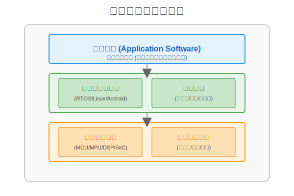

# 嵌入式

## 嵌入式系统概述

### 基本概念
嵌入式系统（Embedded System）是一种**以应用为中心**、**以计算机技术为基础**，并且**软硬件可裁剪**的专用计算机系统。
它主要用于满足应用系统对**功能、可靠性、成本、体积和功耗**等方面的严格要求。

### 核心特征
1.  **专用性强**：通常是为特定的应用场景或任务而设计的，不像通用计算机那样“什么都能干”。
2.  **嵌入性**：从计算机角度看，它是嵌入到各种设备（如汽车、机床、家电）内部的计算机系统。它作为被控设备的一个核心部件，隐藏在设备内部，用户通常感觉不到它的存在。
3.  **资源受限**：由于对体积、成本和功耗的严格限制，嵌入式系统的处理器性能、内存大小和存储空间通常比通用计算机要小得多。
4.  **高可靠性**：许多嵌入式系统（如医疗设备、汽车刹车系统）需要长时间稳定运行，对可靠性要求极高。

### 系统组成
一般而言，嵌入式系统由以下四大部分组成：

1.  **嵌入式处理器**：系统的“大脑”，如单片机 (MCU)、数字信号处理器 (DSP)、嵌入式微处理器 (MPU) 或片上系统 (SoC)。
2.  **相关支撑硬件**：包括存储器（Flash, RAM）、外设接口（GPIO, UART, I2C）、传感器和执行器等。
3.  **嵌入式操作系统 (EOS)**：负责管理硬件资源和调度任务。根据实时性要求，可分为实时操作系统 (RTOS，如 VxWorks, FreeRTOS) 和分时操作系统 (如 Linux, Android)。
4.  **应用软件**：运行在操作系统之上的特定功能软件，实现具体的控制逻辑或业务功能。

> **Tags**: #嵌入式系统 #基本概念 #系统组成 #专用计算机

## 嵌入式中的混成系统

通俗来讲，嵌入式中的混成系统是指同时包含连续动态行为和离散事件行为的系统。连续动态行为通常是指随时间连续变化的物理过程，比如温度、速度、压力等的变化；而离散事件行为则是指那些突然发生的、状态会产生跳跃变化的事件，比如开关的闭合与断开、传感器的触发等。混成系统就是将这两种不同类型的行为结合在一起，相互作用、协同工作。

举个简单的例子，汽车的自动巡航控制系统就是一个典型的混成系统。在这个系统中，连续动态行为表现为汽车的速度随时间连续变化，受到发动机的驱动力、空气阻力、路面摩擦力等因素的影响。而离散事件行为则包括驾驶员按下巡航开启/关闭按钮、设置巡航速度、踩下刹车等操作。当驾驶员按下巡航开启按钮（离散事件），系统会进入巡航状态，开始根据当前车速与设定车速的偏差，连续地调整发动机的输出功率（连续动态行为），以保持车速稳定；当驾驶员踩下刹车（离散事件），巡航系统会立即退出工作状态。
## 实时操作系统示例

在嵌入式系统中，实时操作系统可分为弱实时操作系统和强实时操作系统，下面分别举例说明：

### 弱实时操作系统
弱实时操作系统对任务的响应时间要求相对宽松，允许在一定范围内有延迟，不会因为偶尔的延迟而导致系统出现严重问题。常见的弱实时操作系统如 Linux 的桌面版，虽然 Linux 本身具备一定的实时性改进能力（如 PREEMPT_RT 补丁），但默认的桌面版 Linux 主要用于日常办公、娱乐等场景，对于任务的响应时间没有严格的硬指标要求。例如在使用桌面版 Linux 进行网页浏览、文档编辑时，系统偶尔的延迟并不会对用户体验造成致命影响。

### 强实时操作系统
强实时操作系统必须在严格的时间约束内完成任务，任何超出时限的延迟都可能导致系统故障甚至危及安全。例如 VxWorks，它被广泛应用于航空航天、工业控制等领域。在飞行器的飞行控制系统中，VxWorks 要实时处理各种传感器数据并控制飞行器的飞行姿态，必须在微秒级甚至更短的时间内完成任务调度和响应，否则可能导致飞行事故。又如 QNX，常用于汽车电子系统，像汽车的防抱死制动系统（ABS）就依赖 QNX 实时处理车轮转速传感器的数据，及时调整制动压力，确保在紧急制动时车辆不会抱死，保障行车安全。

## 嵌入式系统架构

## 内核架构：宏内核与微内核的区别

在嵌入式系统的内核架构中，宏内核（Monolithic Kernel）和微内核（Microkernel）是两种常见且特性迥异的设计模式，下面从多个方面介绍它们的区别：

### 结构设计
- **宏内核**：将操作系统的主要功能模块，如进程管理、内存管理、文件系统、设备驱动等都集成在一个内核空间中。整个内核是一个完整的可执行程序，模块之间可以直接调用，结构紧凑。
- **微内核**：只把最基本的功能（如进程调度、内存管理基础、进程间通信等）放在内核空间，而其他功能模块（如文件系统、设备驱动等）则作为用户进程运行。各模块之间通过消息传递机制进行通信。

### 性能表现
- **宏内核**：由于模块间直接调用，减少了用户态和内核态之间的切换开销，因此在性能上通常具有较高的执行效率，系统响应速度快。
- **微内核**：模块间通过消息传递通信，增加了额外的开销，性能相对较低。不过，这种设计使得系统的并发处理能力更强，各模块可以独立运行。

### 可维护性与可扩展性
- **宏内核**：因为所有模块紧密集成，修改或添加一个模块可能会影响到其他模块，导致系统的可维护性和可扩展性较差。一旦内核出现问题，可能会导致整个系统崩溃。
- **微内核**：各模块独立运行，修改或添加一个模块不会影响其他模块，系统的可维护性和可扩展性较好。当某个模块出现问题时，不会影响整个系统的运行，系统的可靠性更高。

### 应用场景
- **宏内核**：适用于对性能要求较高、功能相对固定的嵌入式系统，如一些工业控制、实时监控系统等。Linux 内核就是宏内核的典型代表。
- **微内核**：适用于对系统可靠性和可扩展性要求较高的场景，如航空航天、医疗设备等对安全要求极高的嵌入式系统。QNX 是微内核的典型代表。

## 嵌入式数据库分类

在嵌入式系统中，数据库可根据存储和访问方式分为文件数据库、内存数据库和网络数据库，以下是具体介绍及举例：

### 文件数据库
文件数据库将数据存储在文件系统中，以文件的形式对数据进行管理。这种数据库适合对数据持久化存储有需求，且数据量相对较小、访问频率不高的场景。
- **SQLite**：是一款轻量级的文件数据库，具有零配置、无需服务器、占用资源少等特点。它被广泛应用于移动设备、嵌入式设备等，如 Android 系统就将 SQLite 作为默认的嵌入式数据库，用于存储应用程序的数据。

### 内存数据库
内存数据库将数据存储在内存中，通过内存来实现数据的快速读写，因此具有极高的访问速度。它适用于对数据读写速度要求极高、需要实时处理数据的场景。
- **Redis**：虽然 Redis 通常作为分布式缓存使用，但也可作为嵌入式内存数据库。它支持多种数据结构，如字符串、哈希表、列表等，能满足不同的业务需求。在一些实时监控系统中，Redis 可以快速存储和读取监控数据，实现实时数据分析。

### 网络数据库
网络数据库通过网络进行数据的存储和访问，数据存储在远程服务器上，客户端通过网络请求与数据库进行交互。这种数据库适合需要多设备共享数据、数据量较大的场景。
- **Couchbase Lite**：是 Couchbase 数据库的嵌入式版本，支持离线操作和数据同步。它可以在嵌入式设备上运行，同时能与云端的 Couchbase 服务器进行数据同步，实现多设备间的数据共享。例如在物联网应用中，多个设备可以通过 Couchbase Lite 与云端数据库同步数据，实现数据的集中管理。

## 嵌入式系统的典型架构模式

大多数嵌入式系统都具备实时特征，其典型架构可概括为**层次化模式**和**递归模式**两种。

### 1. 层次化模式 (Layered Pattern)

层次化模式通过将系统划分为若干个层次，高层抽象概念依赖于底层具体概念来实现。这种模式有助于降低系统的耦合度，提高可维护性。

*   **基本结构**：通常包括硬件层、硬件抽象层 (HAL)、操作系统/中间件层、应用层。
*   **两种类型**：
    *   **封闭型 (Closed)**：一层中的对象只能调用其**直接下层**提供的接口。
        *   *优点*：依赖关系清晰，可维护性强，移植性好。
        *   *缺点*：因为需要层层传递，性能开销较大。
    *   **开放型 (Open)**：一层中的对象可以调用**其下任何一层**提供的接口。
        *   *优点*：减少了中间调用环节，性能较好。
        *   *缺点*：破坏了封装性，层级依赖混乱，导致移植和维护困难。

### 2. 递归模式 (Recursive Pattern)

递归模式适用于非常复杂的系统，解决的是如何将一个复杂系统分解为可管理的子系统，并确保这种分解过程是可扩展的。

*   **核心思想**：利用“包含”关系，将系统视为由若干子系统组成，每个子系统又可以进一步分解为更小的子系统或组件。这种结构类似于“俄罗斯套娃”。
*   **开发流程**：
    *   **自顶向下 (Top-Down)**：从系统层级开始，识别出实现协作的子系统，逐步细化抽象层级，直到具体的组件。
    *   **自底向上 (Bottom-Up)**：从现有的组件开始，组合成子系统，再组合成更大的系统。
*   **优点**：
    *   **应对复杂性**：通过层层分解，将巨型系统拆解为可控的小单元。
    *   **可验证性**：在每一步细化过程中，都可以对系统进行可靠性和实时性的验证。
    *   **并行开发**：不同的子系统可以独立开发和测试。

