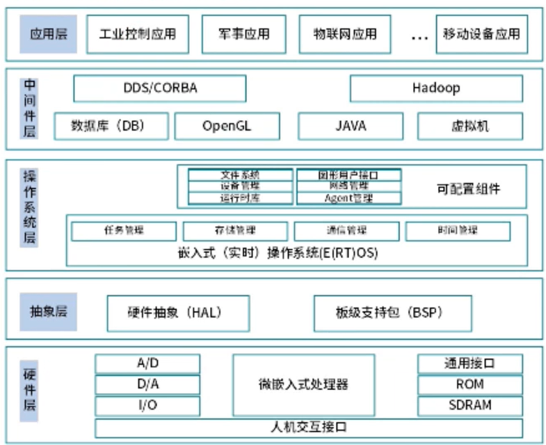

# 嵌入式
## 嵌入式中的混成系统

通俗来讲，嵌入式中的混成系统是指同时包含连续动态行为和离散事件行为的系统。连续动态行为通常是指随时间连续变化的物理过程，比如温度、速度、压力等的变化；而离散事件行为则是指那些突然发生的、状态会产生跳跃变化的事件，比如开关的闭合与断开、传感器的触发等。混成系统就是将这两种不同类型的行为结合在一起，相互作用、协同工作。

举个简单的例子，汽车的自动巡航控制系统就是一个典型的混成系统。在这个系统中，连续动态行为表现为汽车的速度随时间连续变化，受到发动机的驱动力、空气阻力、路面摩擦力等因素的影响。而离散事件行为则包括驾驶员按下巡航开启/关闭按钮、设置巡航速度、踩下刹车等操作。当驾驶员按下巡航开启按钮（离散事件），系统会进入巡航状态，开始根据当前车速与设定车速的偏差，连续地调整发动机的输出功率（连续动态行为），以保持车速稳定；当驾驶员踩下刹车（离散事件），巡航系统会立即退出工作状态。
## 实时操作系统示例

在嵌入式系统中，实时操作系统可分为弱实时操作系统和强实时操作系统，下面分别举例说明：

### 弱实时操作系统
弱实时操作系统对任务的响应时间要求相对宽松，允许在一定范围内有延迟，不会因为偶尔的延迟而导致系统出现严重问题。常见的弱实时操作系统如 Linux 的桌面版，虽然 Linux 本身具备一定的实时性改进能力（如 PREEMPT_RT 补丁），但默认的桌面版 Linux 主要用于日常办公、娱乐等场景，对于任务的响应时间没有严格的硬指标要求。例如在使用桌面版 Linux 进行网页浏览、文档编辑时，系统偶尔的延迟并不会对用户体验造成致命影响。

### 强实时操作系统
强实时操作系统必须在严格的时间约束内完成任务，任何超出时限的延迟都可能导致系统故障甚至危及安全。例如 VxWorks，它被广泛应用于航空航天、工业控制等领域。在飞行器的飞行控制系统中，VxWorks 要实时处理各种传感器数据并控制飞行器的飞行姿态，必须在微秒级甚至更短的时间内完成任务调度和响应，否则可能导致飞行事故。又如 QNX，常用于汽车电子系统，像汽车的防抱死制动系统（ABS）就依赖 QNX 实时处理车轮转速传感器的数据，及时调整制动压力，确保在紧急制动时车辆不会抱死，保障行车安全。

## 嵌入式系统架构

## 内核架构：宏内核与微内核的区别

在嵌入式系统的内核架构中，宏内核（Monolithic Kernel）和微内核（Microkernel）是两种常见且特性迥异的设计模式，下面从多个方面介绍它们的区别：

### 结构设计
- **宏内核**：将操作系统的主要功能模块，如进程管理、内存管理、文件系统、设备驱动等都集成在一个内核空间中。整个内核是一个完整的可执行程序，模块之间可以直接调用，结构紧凑。
- **微内核**：只把最基本的功能（如进程调度、内存管理基础、进程间通信等）放在内核空间，而其他功能模块（如文件系统、设备驱动等）则作为用户进程运行。各模块之间通过消息传递机制进行通信。

### 性能表现
- **宏内核**：由于模块间直接调用，减少了用户态和内核态之间的切换开销，因此在性能上通常具有较高的执行效率，系统响应速度快。
- **微内核**：模块间通过消息传递通信，增加了额外的开销，性能相对较低。不过，这种设计使得系统的并发处理能力更强，各模块可以独立运行。

### 可维护性与可扩展性
- **宏内核**：因为所有模块紧密集成，修改或添加一个模块可能会影响到其他模块，导致系统的可维护性和可扩展性较差。一旦内核出现问题，可能会导致整个系统崩溃。
- **微内核**：各模块独立运行，修改或添加一个模块不会影响其他模块，系统的可维护性和可扩展性较好。当某个模块出现问题时，不会影响整个系统的运行，系统的可靠性更高。

### 应用场景
- **宏内核**：适用于对性能要求较高、功能相对固定的嵌入式系统，如一些工业控制、实时监控系统等。Linux 内核就是宏内核的典型代表。
- **微内核**：适用于对系统可靠性和可扩展性要求较高的场景，如航空航天、医疗设备等对安全要求极高的嵌入式系统。QNX 是微内核的典型代表。
