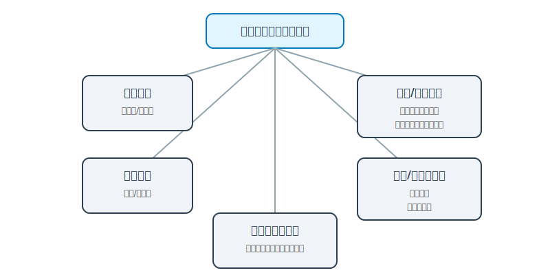

# 数据库系统

在数据库设计过程中，当进行数据集成时，常常会遇到属性冲突、命名冲突和结构冲突这三种冲突，下面分别对它们进行介绍：

### 属性冲突

属性冲突主要分为两种情况：

1.  **属性域冲突**：即同一属性在不同局部应用中的数据类型、取值范围或取值集合不同。例如，在一个部门管理系统中，员工编号可能被定义为字符型，而在另一个考勤系统中，员工编号可能被定义为整型。
2.  **属性取值单位冲突**：同一属性在不同局部应用中的取值单位不一致。比如，在库存管理系统中，商品重量的单位可能是千克，而在销售系统中，商品重量的单位可能是克。

### 命名冲突

命名冲突也有两种表现形式：

1.  **同名异义**：不同意义的对象在不同的局部应用中具有相同的名字。例如，在学生管理系统和教师管理系统中，“编号”这个名称在学生管理里指的是学生编号，在教师管理里指的是教师编号。
2.  **异名同义（一义多名）**：同一意义的对象在不同的局部应用中具有不同的名字。比如，在员工信息系统中，“员工姓名”在另一个系统中可能被称为“职工姓名”。

### 结构冲突

结构冲突主要包含以下几种情况：

1.  **同一对象在不同应用中具有不同的抽象**：例如，在一个系统中，“课程”被抽象为实体，而在另一个系统中，“课程”可能被抽象为属性。
2.  **同一实体在不同局部视图中所包含的属性不完全相同，或者属性的排列次序不完全相同**：比如，在学生基本信息管理系统中，学生实体包含学号、姓名、性别等属性；而在学生成绩管理系统中，学生实体除了上述属性外，还包含班级、入学时间等属性。
3.  **实体之间的联系在不同局部视图中呈现不同的类型**：例如，在某一局部应用中，实体 A 和实体 B 之间是一对一的联系，而在另一个局部应用中，它们之间可能是一对多的联系。

> **Tags**: #数据库系统 #数据集成 #属性冲突 #命名冲突 #结构冲突

---

## 分布式数据库的分片方式

直观地讲，“分片”就是把原本放在一台库里的数据**拆成多块，分散放到多台库上**，从而提升容量和并发能力。常见分片方式可以从“**切哪一维、怎么切**”来理解。

### 1. 垂直分片（按模块/表分片）

*   **思路**：按业务模块或表来拆库，例如：
    *   用户中心库：user\_info，user\_profile
    *   订单库：order\_main，order\_item
    *   支付库：payment\_order，payment\_log
*   **特点**：
    *   每个库负责一块业务领域，**表结构不变，只是按功能分散到不同实例**。
    *   比较像“把单体系统拆成多个微服务，对应多个数据库”。
*   **优点**：
    *   业务边界清晰，易于理解和运维。
    *   运维上可以按模块扩容、迁移，不影响其他模块。
*   **缺点**：
    *   **跨库关联查询变多**，需要在应用层做聚合。
    *   单库内部如果数据量继续膨胀，仍然要再做水平分片。

### 2. 水平分片（按行分片）

水平分片是把同一张逻辑表的一行行记录，按某种规则切分到多个物理分片上，常见方式有：

#### 2.1 按范围分片（Range Sharding）

*   **规则示例**：
    *   user\_id 1–1 000 000 在 shard\_1
    *   user\_id 1 000 001–2 000 000 在 shard\_2
*   **优点**：
    *   容易理解，按区间扩容也很直观（新增区间对应新的分片）。
    *   便于按时间范围、ID 区间等做查询和归档。
*   **缺点**：
    *   容易产生**热点分片**（比如最近时间段的数据都集中在一个分片）。

#### 2.2 按哈希分片（Hash Sharding）

*   **规则示例**：`shard_id = hash(user_id) mod N`
*   **优点**：
    *   数据在各分片间相对均匀，**能有效缓解热点**。
*   **缺点**：
    *   动态扩容/缩容时，需要大量数据迁移（N 变化会导致取模结果大规模变化）。

#### 2.3 按列表/枚举分片（List Sharding）

*   **规则示例**：
    *   region in ('华北', '东北') → shard\_1
    *   region in ('华东', '华中') → shard\_2
*   **特点**：
    *   适合**枚举型、离散型字段**，比如地区、业务线、租户类型等。

#### 2.4 组合分片（Hybrid Sharding）

*   **思路**：把上面几种方式组合起来，例如：
    *   先按地区做列表分片，再在每个地区内按 user\_id 哈希分片。
*   **适用场景**：
    *   数据量极大且维度复杂，希望同时兼顾**数据本地性（如按地区就近访问）**和**负载均衡**。

### 3. 一致性哈希分片

一致性哈希更常见于**分布式缓存/键值存储**（如 Redis 集群），核心思想是：

*   把所有物理节点映射到一个“哈希环”上；
*   key 也通过哈希映射到环上的某一点；
*   key 归属于“顺时针方向上遇到的第一个节点”。

**优势**：

*   当增加或减少节点时，**只会影响环上一小段区间的数据**，避免“全量重分布”的代价。

### 4. 分片设计中的常见问题与解决方法

1.  **跨分片事务难以保证强一致性**
    *   解决思路：
        *   尽量通过**合理选择分片键**，让强一致性需求高的操作落在同一分片。
        *   不能避免时，引入 **TCC、SAGA 等分布式事务模式**，在业务层保证最终一致。
2.  **跨分片查询复杂、性能差**
    *   解决思路：
        *   通过**中间层/网关**聚合各分片结果（如分库分表中间件）。
        *   尽量按“查询维度”来设计分片键，避免大范围跨分片扫描。
3.  **分片扩容/缩容成本高**
    *   解决思路：
        *   预留冗余分片（如逻辑分片多于物理节点），通过“绑定/解绑逻辑分片”方式来扩缩容。
        *   在缓存场景优先考虑**一致性哈希**等方案。

### 5. 其他分片机制与工程实践

1.  **目录/元数据服务（Directory-based）**
    *   维护全局“键 → 分片”的映射表或元数据服务，支持在线调整路由规则。
2.  **分片副本与冗余**
    *   为每个分片配置多副本（主从、多主或共识协议），提升可用性与读扩展能力。
3.  **全局索引与二级路由**
    *   对非分片键属性建立索引时，可采用“索引分片”或“局部索引 + 全局路由”方案，避免全库扫描。
4.  **动态分片与自动再均衡**
    *   根据负载、容量和热点监控自动拆分（split）或合并（merge）分片，并在线迁移数据，保持集群均衡。

> **Tags**: #分布式数据库 #分片 #水平分片 #垂直分片 #一致性哈希

---

## 数据库设计过程：从需求到物理实现

数据库设计可以理解为一个**逐步收敛**的过程：先弄清楚“业务要干什么”（需求），再画清楚“世界长什么样”（概念模型），然后把它翻译成具体的表结构（逻辑模型），最后落到存储和索引等物理细节（物理设计）。

典型上分为四个阶段：

1.  需求分析
2.  概念结构设计
3.  逻辑结构设计
4.  物理设计

### 一、需求分析

**目的**：搞清楚“系统要支持哪些业务场景”和“要存哪些数据”，为后续建模提供依据。

**主要工作：**

1.  **业务需求调研**
    *   访谈业务人员、阅读需求文档，梳理业务流程（下单、支付、发货、售后等）。
2.  **数据需求分析**
    *   列出需要管理的**核心对象**（客户、订单、商品、库存等）及其关键属性。
3.  **约束与非功能需求**
    *   并发量、响应时间、数据安全性、审计要求、历史数据保留周期等。

**常见问题与解决方法：**

*   问题：需求描述模糊、概念不统一（例如“客户”“用户”“账号”混用）。
*   解决方法：通过**术语表 + 统一业务词汇**的方式固化定义，为后续的概念建模打基础。

### 二、概念结构设计

这一阶段的目标是构建与具体 DBMS 无关的**全局概念模型**，常用的表达方式就是 **E-R 图**。

**主要工作：**

1.  **识别实体（Entity）**
    *   比如：学生、课程、教师、订单、客户等。
2.  **识别属性（Attribute）**
    *   每个实体有哪些属性，如学生的学号、姓名、性别、班级等。
3.  **识别联系（Relationship）及其类型**
    *   一对一、一对多、多对多等，例如学生与课程之间的“选课”关系。
4.  **解决局部视图冲突**
    *   这一步会遇到前文提到的**属性冲突、命名冲突和结构冲突**，需要在概念层进行统一。

**常见问题与解决方法：**

*   问题：不同系统/部门对同一实体或属性有不同理解。
*   解决方法：
    *   通过**全局 E-R 模型**统一视图；
    *   引入**全局标识（如统一的客户 ID）**；
    *   通过映射规则解决命名和结构差异。

### 三、逻辑结构设计

逻辑结构设计的目标是将概念模型（E-R 图）**映射为特定数据模型**，在关系型数据库中主要是映射为**关系模式（表结构）**。

**主要工作：**

1.  **E-R 向关系模式的转换**
    *   实体 → 表；
    *   属性 → 字段；
    *   联系 → 外键或中间表（特别是多对多关系）。
2.  **规范化设计**
    *   根据 1NF、2NF、3NF 乃至 BCNF，对关系模式进行规范化，消除部分冗余和异常更新问题。
3.  **确定主键与外键**
    *   为每个表选择合理的主键（自然键 vs 代理键）；
    *   设计外键保证参照完整性。
4.  **考虑分布式与分片（如有）**
    *   在分布式场景下，需要在逻辑层明确**分库分表策略、分片键**，与“分片方式”小节形成呼应。

**常见问题与解决方法：**

*   问题：过度规范化导致查询需要大量关联，性能差。
*   解决方法：
    *   在性能敏感场景下，适当**反规范化**（例如冗余部分字段，增加汇总表），以换取查询性能；
    *   对核心查询路径进行 SQL 优化与索引设计。

### 四、物理设计

物理设计关注“**数据如何高效地存到磁盘上，以及如何快速取回来**”，与具体 DBMS 及部署环境密切相关。

**主要工作：**

1.  **存储结构与文件组织**
    *   选择合适的存储引擎（如 InnoDB、MyISAM 等）；
    *   规划表空间、数据文件位置等。
2.  **索引设计**
    *   为高频查询字段建立合适的索引（B+ 树索引、联合索引、覆盖索引等）；
    *   平衡“查询加速”和“写入开销及存储开销”。
3.  **分区与分表策略**
    *   按时间、按范围、按哈希等方式对大表做分区；
    *   在分布式系统中，与分片策略配合使用。
4.  **缓存与物理冗余**
    *   利用数据库内部缓存、外部缓存（Redis 等）；
    *   通过主从复制、备库、归档等手段保证可用性和恢复能力。

**常见问题与解决方法：**

*   问题：某些业务查询频繁扫描大表或频繁做回表操作，导致性能瓶颈。
*   解决方法：
    *   针对热点 SQL 进行**索引重构**或**引入冗余字段形成覆盖索引**；
    *   必要时将热点数据拆分成单独的物理表或分区。

> **Tags**: #数据库设计 #需求分析 #概念结构设计 #逻辑结构设计 #物理设计
