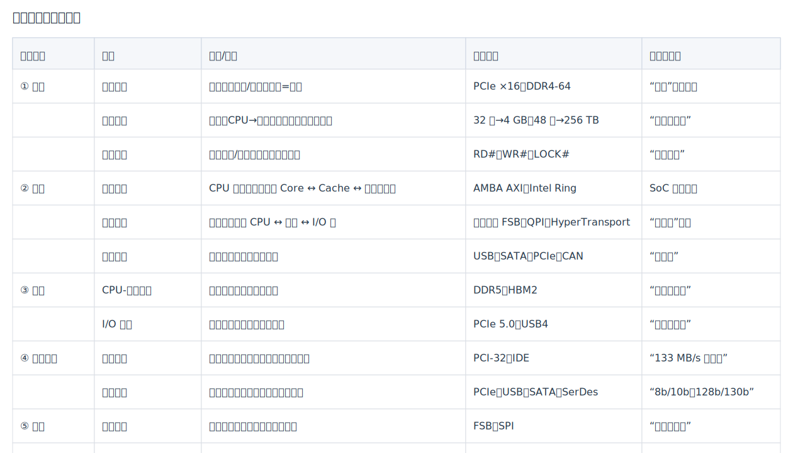
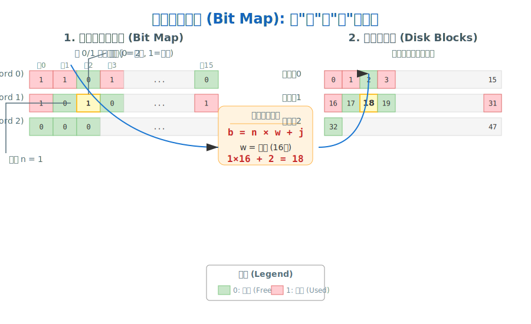
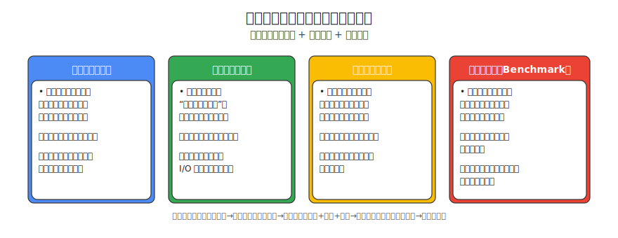

# 计算机系统基础

## 冯·诺依曼体系结构

现代计算机普遍采用“冯·诺依曼体系结构”，其核心思想可概括为“程序存储、顺序执行”。理解该模型是后续学习指令流水线、缓存、并行等概念的前提。

### 一、五大组成部分
1. 运算器（ALU）：完成算术/逻辑运算  
2. 控制器（CU）：解释指令并产生控制信号  
3. 存储器：统一存放指令与数据（线性地址空间）  
4. 输入设备：将外部信息转为机器可识别格式  
5. 输出设备：将处理结果呈现给外部世界  

> 注：运算器+控制器+若干寄存器集成在一起即现代CPU；输入/输出设备统称I/O。

### 二、三大核心思想
1. 程序存储：指令与数据以同等地位保存在存储器中，运行时按需读取  
2. 顺序执行：除非遇到跳转/分支指令，否则按地址递增顺序逐条执行  
3. 总线结构：地址总线、数据总线、控制总线实现五大部件互连，共享同一存储空间  

### 三、典型工作流程（取指-译码-执行循环）
1. PC → 地址总线 → 存储器  
2. 存储器 → 数据总线 → IR（指令寄存器）  
3. CU 译码，产生微操作信号  
4. ALU 在时钟驱动下完成运算，结果写回寄存器或存储器  
5. PC 自增或跳转，回到步骤1  

### 四、性能瓶颈与改进
1. 存储墙：CPU速度 >> 主存速度 → 引入Cache、多级缓存、预取技术  
2. 指令串行 → 指令流水线、超标量、乱序执行  
3. 总线竞争 → 多级总线、交叉开关、片上网络（NoC）  
4. 能耗墙 → 多核/众核、DVFS、近阈值计算  

### 五、冯·诺依曼 vs 哈佛结构
| 特征 | 冯·诺依曼 | 哈佛 |
|----|--------|------|
| 存储空间 | 指令与数据统一 | 指令与数据分离 |
| 总线 | 共享数据/地址总线 | 独立指令/数据总线 |
| 优点 | 结构简单、成本低 | 并行取指取数、高吞吐 |
| 应用 | 通用PC、服务器 | DSP、嵌入式MCU、高性能Cache |

现代CPU在片内Cache级常采用“哈佛逻辑分离、冯·诺依曼整体统一”的混合方案，兼顾性能与兼容性。

### 六、小结
冯·诺依曼体系结构奠定了“软件通过指令驱动硬件”的计算范式；后续所有性能优化（流水线、Cache、并行、多核）都是在该范式下解决“存储墙”“并行墙”“能耗墙”三大瓶颈。系统架构师需牢记：任何新技术是否成功，往往取决于它对冯·诺依曼模型的兼容与突破程度。

## 通信方式：单工、半双工、全双工

### 一、基本概念
- 单工（Simplex）：数据仅能沿一个固定方向传输，另一方向不可用。
- 半双工（Half-Duplex）：数据可双向传输，但同一时刻仅一个方向工作。
- 全双工（Full-Duplex）：数据可双向同时传输，双方可并发发送与接收。

### 二、典型示例
- 单工：广播电视、键盘→主机输入、监控摄像头单向上报。
- 半双工：对讲机、RS-485总线、共享介质以太网（启用CSMA/CD时）。
- 全双工：电话、交换机直连以太网（现代网口）、PCIe、UART（独立TX/RX线路）。

### 三、对比与特性
| 维度 | 单工 | 半双工 | 全双工 |
|----|----|----|----|
| 方向能力 | 单向 | 双向（交替） | 双向（同时） |
| 并发性 | 无 | 低 | 高 |
| 冲突处理 | 无 | 需介质访问控制（如轮询/CSMA/CD） | 不需（点对点隔离） |
| 吞吐潜力 | 低 | 中 | 高 |
| 硬件与布线 | 简单 | 中等 | 需分别发送/接收或多通道 |
| 典型场景 | 广播/上报 | 多点总线/成本敏感 | 高吞吐/低时延点对点 |

### 四、应用场景
- 单工：遥测、日志/事件单向采集、告警广播。
- 半双工：多节点共享总线、主从轮询、低成本工业现场通信。
- 全双工：数据库复制、服务间RPC、音视频通话、数据中心链路。

### 五、选择建议（解决方法）
- 延迟敏感与高并发交互：选全双工，避免等待与冲突。
- 多节点共享介质、成本受限：选半双工，并配合轮询/时隙/仲裁。
- 仅需单向上报或广播：选单工，简化设计与布线。
- 以太网配置：交换机与网卡双工模式需匹配，避免“双工不一致”导致重传与性能骤降。
- 串口/总线判断：RS-232/UART通常支持全双工；RS-485常见半双工；CAN为仲裁型多主总线，不以“单双工”界定。

### 六、注意事项
- 双工模式必须端到端一致：任一端设为半双工将引发性能问题。
- 半双工系统需明确介质访问控制策略（如主从轮询、时隙分配、CSMA/CD），否则易产生冲突与饥饿。
- 全双工链路仍需流控与缓冲管理，防止接收端过载（如TCP窗口、以太网PAUSE帧）。

## 标签
#计算机网络 #通信方式 #单工 #半双工 #全双工 #系统架构基础


## 总线分类全景图

> 总线（Bus）是计算机五大部件之间“公共通路”，可从**功能、位置、层次、数据格式、时序、仲裁方式**六大视角拆解。下面给出一张“六维分类表”，便于系统架构师快速定位考点。

| 分类维度 | 子类 | 定义/特征 | 典型实例 | 考试关键词 |
|---|---|---|---|---|
| ① 功能 | 数据总线 | 双向传输指令/数据，宽度=位宽 | PCIe ×16、DDR4-64 | “位宽”决定带宽 |
|  | 地址总线 | 单向（CPU→外设），宽度决定寻址空间 | 32 位→4 GB，48 位→256 TB | “地址线数量” |
|  | 控制总线 | 传输命令/时序，每根线独立含义 | RD#、WR#、LOCK# | “读写信号” |
| ② 位置 | 片内总线 | CPU 芯片内部，连接 Core ↔ Cache ↔ 内存控制器 | AMBA AXI、Intel Ring | SoC 面试高频 |
|  | 系统总线 | 主板级，连接 CPU ↔ 主存 ↔ I/O 桥 | 前端总线 FSB、QPI、HyperTransport | “南北桥”时代 |
|  | 外设总线 | 扩展槽或电缆，连接外设 | USB、SATA、PCIe、CAN | “热插拔” |
| ③ 层次 | CPU-存储总线 | 短距离、高带宽、低延迟 | DDR5、HBM2 | “并行、同步” |
|  | I/O 总线 | 长距离、可扩展、协议复杂 | PCIe 5.0、USB4 | “串行、差分” |
| ④ 数据格式 | 并行总线 | 一次传多位，线间同步难，频率受限 | PCI-32、IDE | “133 MB/s 天花板” |
|  | 串行总线 | 一位一位传，嵌入式时钟，高频率 | PCIe、USB、SATA、SerDes | “8b/10b、128b/130b” |
| ⑤ 时序 | 同步总线 | 公共时钟，协议简单，速比固定 | FSB、SPI | “时钟沿采样” |
|  | 异步总线 | 握手协议，无时钟，延迟自适应 | USB、CAN、AMBA AXI-4 Stream | “Ready/Valid” |
| ⑥ 仲裁方式 | 集中仲裁 | 独立仲裁器，优先级可编程 | PCI、AMB AHB | “总线总裁” |
|  | 分布仲裁 | 各主设备自仲裁，菊花链或独立请求 | USB、CAN、PCIe | “冲突检测+重试” |

> 记忆口诀：  
> “**功位层数次仲**”——功(功能)位(位置)层(层次)数(数据格式)次(时序)仲(仲裁)。

### 一图速记



## 操作系统分类：批处理、分时、实时、网络、分布式、微机、嵌入式
### 一、批处理操作系统（Batch OS）
- **核心思想**：将作业（程序+数据+控制信息）按批次输入系统，由监督程序自动依次处理，无需人工干预，追求作业吞吐量和资源利用率最大化。
- **单道批处理（Simple Batch）**
  - 特征：内存仅驻留一道作业，CPU等待I/O时处于空闲，利用率低。
  - 硬件支持：早期卡片/磁带机+通道技术，引入“监督程序”管理作业切换。
  - 代表：FMS（FORTRAN Monitor System）、IBM 1401 系统。
- **多道批处理（Multiprogrammed Batch）**
  - 特征：内存同时驻留多道作业，当某作业I/O时，CPU立即切换至另一道，显著降低空闲率。
  - 关键技术：作业调度、内存分区、设备分配、Spooling（假脱机）。
  - 代表：IBM OS/360、早期MVS，是现代分时系统的前身。
- **性能指标**：作业平均周转时间、系统吞吐率、CPU利用率。
- **优缺点**：
  - 优点：自动化、高吞吐、资源利用率高（多道）。
  - 缺点：无交互能力，调试困难，响应时间不可预测。
- **演进**：批处理→分时（引入时间片）→实时/网络/分布式，形成现代OS家族。

> 记忆口诀：  
> “单道空等低利用率，多道切换高吞吐；批处理打基础，分时实时再分流。”

### 二、分时操作系统（Time-Sharing OS）
- **核心思想**：把 CPU 时间划分为极短的时间片（如 10 ms），轮流分配给多个终端用户，宏观上“一人一机”，微观上“一机多人”。
- **关键特征**  
  - 多路性：同时支持数十上百个终端。  
  - 交互性：用户通过键盘/屏幕直接调试、编辑、运行程序。  
  - 独占感：响应时间 < 3 s，用户察觉不到他人存在。  
- **性能指标**：平均响应时间、吞吐率、公平性。  
- **代表系统**：UNIX（早期）、Linux、Windows Server 多用户模式。  

### 三、实时操作系统（Real-Time OS，RTOS）
- **核心思想**：在“截止时间”内完成指定功能， correctness ≈ 逻辑正确 + 时间正确。  
- **分类**  
  - 硬实时：超时即灾难，如飞机飞控、心脏起搏器。  
  - 软实时：超时降低体验，如视频播放器、网络电话。  
- **关键特征**  
  - 确定性：中断延迟 < 5 µs、任务切换 < 1 µs。  
  - 优先级驱动：支持 256+ 级抢占式调度。  
  - 资源预留：CPU、内存、带宽提前锁定。  
- **代表系统**：VxWorks、QNX、RT-Thread、FreeRTOS。  

### 四、网络操作系统（Network OS）
- **核心思想**：在单机 OS 之上增加“网络透明”服务，使异构主机互联互通。  
- **关键功能**  
  - 文件/打印共享：如 SMB、NFS。  
  - 用户管理：统一域控（Active Directory、LDAP）。  
  - 消息与 RPC：远程过程调用透明化。  
- **代表系统**：Windows Server、Novell NetWare（早期）、macOS Server。  

### 五、分布式操作系统（Distributed OS）
- **核心思想**：把多台独立计算机“虚拟”成一台单一、统一的计算机，用户无需关心资源位置。  
- **关键特征**  
  - 单一系统映像：一个全局文件系统（如 Google GFS）。  
  - 进程迁移：任务可在节点间透明漂移（负载均衡）。  
  - 容错冗余：多副本、拜占庭协议保证高可用。  
- **与网络 OS 区别**：分布式 OS 内核本身即集群化，而网络 OS 仅是单机内核叠加网络协议。  
- **代表系统/框架**：Amoeba（学术）、Plan 9、Google Borg/Kubernetes（准分布式）。  

### 六、微机操作系统（Microcomputer OS）

- **核心思想**：面向个人计算机（PC）设计，强调图形用户界面（GUI）、多任务、设备即插即用与生态兼容性，兼顾桌面办公、多媒体与轻量级服务器需求。  
- **关键特征**  
  - 图形界面：窗口、图标、菜单、指针（WIMP）成为标配，降低使用门槛。  
  - 多任务抢占：时间片轮转+优先级抢占，前台响应流畅，后台任务不“卡死”。  
  - 驱动模型：总线枚举→驱动匹配→即插即用（PNP），支持海量第三方硬件。  
  - 生态兼容：二进制兼容旧应用、API 向后兼容、应用商店/安装包并存。  
- **常见形态**  
  - 桌面级：Windows 11、macOS、Ubuntu Desktop。  
  - 轻服务器级：Windows Server Essentials、Ubuntu Server（CLI 版）。  
- **演进趋势**  
  - 云-端协同：OneDrive、iCloud、Ubuntu One 实现配置/数据无缝漫游。  
  - 异构算力：原生支持 CPU+GPU+NPU 混合调度，满足 AI 推理、图形渲染需求。  
  - 安全隔离：虚拟化容器（WSL2、Docker Desktop）运行 Linux 子系统，开发便捷。  

> 记忆口诀：  
> “微机面向人，图形多任务；驱动即插用，生态靠兼容；云-端再融合，异构算力通。”

### 七、嵌入式操作系统（Embedded OS）
- **核心思想**：面向特定应用裁剪，追求“够用即可”的最小资源占用。  
- **关键特征**  
  - 微型化：内核 < 100 KB，可固化在 ROM。  
  - 低功耗：支持 DVFS、深度睡眠 < 1 µA。  
  - 确定性：中断可预测，支持 Bare-metal 启动。  
  - 专用 IO：GPIO、PWM、CAN、ADC 直接驱动。  
- **常见形态**  
  - RTOS 型：FreeRTOS、Zephyr。  
  - 通用裁剪型：嵌入式 Linux、Android Things。  
  - 裸机框架：Arduino、RT-Thread Nano。  

### 八、七类对比速览表

| 维度 | 批处理 | 分时 | 实时 | 网络 | 分布式 | 微机 | 嵌入式 |
|---|---|---|---|---|---|---|---|
| **首要目标** | 资源利用率/吞吐量 | 多用户交互 | 截止时间 | 资源共享 | 全局统一 | 个人体验 | 专用精简 |
| **交互性** | 无（脱机） | 强（独占） | 弱（专用） | 强（远程） | 强（透明） | 极强（GUI） | 弱（专用） |
| **响应时间** | 小时级 | 秒级 | 微秒级 | 视网络 | 视负载 | 毫秒级 | 微秒级 |
| **关键技术** | Spooling | 时间片 | 抢占/中断 | 协议/RPC | 迁移/全局FS | GUI/PNP | 裁剪/低功耗 |
| **典型代表** | MVS | UNIX | VxWorks | Windows Svr | Plan 9 | Win/macOS | FreeRTOS |

> 记忆口诀：  
> “批处理重吞吐，分时求交互，实时拼速度，网络搞共享，分布乃一统，微机重体验，嵌入必精简。”

## 线程模型：用户线程、内核线程、轻权线程
### 一、基本定义
- 用户线程（User Thread）：在线程库（用户态）实现的线程，创建/销毁/调度均在用户态完成，内核不可见为“线程”，仅看到单一进程。
- 内核线程（Kernel Thread）：由内核直接管理与调度的执行实体，每个线程都有独立的内核上下文与调度队列项。
- 轻权线程（Lightweight Process, LWP）：作为“用户线程 ↔ 内核执行单元”的桥梁与载体；典型实现中，LWP与内核线程一一对应，用于承载用户线程在核上的运行。

### 二、映射关系与模型
- 1:1（用户线程:内核线程）  
  - 每个用户线程对应一个内核线程（即一个 LWP）。  
  - 优点：利用内核调度与多核并行；阻塞不影响其他线程。  
  - 缺点：创建/切换开销较高，线程数量受内核资源限制。  
  - 代表：Linux NPTL、Windows 线程。
- M:1（多用户线程:单内核线程）  
  - 多个用户线程在用户态调度，内核只见一个执行实体。  
  - 优点：切换快、开销低、数量可很大。  
  - 缺点：任一阻塞系统调用会阻塞整个进程；无法利用多核。  
  - 代表：早期“绿色线程”、部分语言运行时的协程实验实现。
- M:N（多用户线程:多内核线程）  
  - 运行时将大量用户线程映射到少量内核线程（多个 LWP）上。  
  - 优点：兼顾低开销与多核利用；阻塞隔离更好。  
  - 缺点：实现复杂，需协作调度与系统调用封装。  
  - 代表：Solaris 早期线程模型、现代语言运行时（如 Go 的 goroutine 与调度器）。

### 三、关键对比
| 维度 | 用户线程 | 内核线程 | 轻权线程（LWP） |
|----|----|----|----|
| 创建/销毁 | 用户态快速 | 系统调用，开销高 | 伴随内核线程 |
| 上下文切换 | 用户态，极快 | 内核态，较慢 | 随内核线程 |
| 阻塞影响 | 易全局阻塞（M:1） | 仅阻塞当前线程 | 隔离阻塞 |
| 多核利用 | 差（M:1） | 好（1:1） | 好（M:N） |
| 可见性 | 内核不可见为线程 | 内核可见 | 作为桥接实体 |

### 四、调度与系统调用
- 用户线程依赖运行时或线程库的调度器（时间片、优先级或协作式），遇到阻塞调用需非阻塞封装或 I/O 多路复用配合。
- 内核线程由内核统一抢占式调度，可直接调用阻塞系统调用，线程级别的阻塞不会影响同进程其他线程（1:1）。
- M:N 模型通常通过调度器与事件循环（epoll/kqueue/IOCP）将阻塞转化为可调度事件，避免挂死 LWP。

### 五、选型建议
- 高并发 I/O、低延迟：优先 M:N 或用户态线程+事件驱动，实现高密度并发与低切换开销。
- 通用应用与库兼容：采用 1:1，简化实现并充分利用内核能力与工具链。
- 资源受限与实时场景：控制线程数量，避免过多内核线程带来抖动；必要时使用用户态调度减少不可控时延。


## 进程调度算法

在系统架构师考试的计算机系统基础中，进程调度算法是进程管理的核心内容，直接影响系统的性能和资源利用率。以下详细介绍几种常见的进程调度算法：

### 一、先来先服务（First-Come, First-Served，FCFS）

- **基本原理**：按照进程到达就绪队列的先后顺序进行调度，先到达的进程优先获得CPU执行，直到完成或因某种原因（如I/O请求）阻塞才释放CPU。

- **特点**：
  
  - 实现简单，只需维护一个就绪队列，按顺序调度即可。
  - 对长作业有利，但对短作业不利，可能导致短作业长时间等待（“饥饿”现象）。
  - 平均周转时间较长，因为长作业会阻塞后续进程的执行。

- **示例**：若进程A（运行时间10s）先到达，进程B（运行时间2s）后到达，则A先执行10s，完成后B再执行2s，总周转时间为10+12=22s。
  
  ### 二、短作业优先（Shortest Job First，SJF）

- **基本原理**：在就绪队列中，优先选择运行时间最短的进程投入执行（非抢占式）；若有更短的新进程到达，则中断当前进程，优先执行新的短进程（抢占式，也称最短剩余时间优先算法）。

- **特点**：
  
  - 能有效降低平均周转时间和平均等待时间，提高系统吞吐量（单位时间内完成的进程数）。
  - 对长作业不利，可能因不断有短作业到达而长期等待（“饥饿”）。
  - 需预先知道进程的运行时间，实际中难以精确获取（通常基于估计值）。

- **示例**：若进程A（10s）、B（2s）、C（5s）先后到达，SJF会先调度B（2s完成），再调度C（5s完成），最后调度A（10s完成），总周转时间为2+7+17=26s，优于FCFS。
  
  ### 三、优先级调度（Priority Scheduling）

- **基本原理**：为每个进程分配一个优先级（整数表示，数值越大优先级越高或越低，具体依系统而定），调度时优先选择优先级最高的进程执行。

- **分类**：
  
  - 静态优先级：进程创建时确定优先级，且运行期间不变（如根据进程类型、资源需求等设定）。
  - 动态优先级：进程运行期间优先级可动态调整（如等待时间越长，优先级越高，避免“饥饿”）。

- **特点**：
  
  - 灵活性高，可根据系统目标（如实时性、资源利用率）调整优先级策略（如实时进程优先级高于普通进程）。
  - 可能导致低优先级进程长期等待（“饥饿”），需通过“老化”机制（逐渐提高等待进程的优先级）缓解。

- **示例**：优先级P1>P2>P3，若P2正在执行，P1到达则P2被中断，P1优先执行。
  
  ### 四、抢占式与非抢占式（基于调度时机的分类）

- **非抢占式（Non-preemptive）**：
  
  - 进程一旦获得CPU，会一直执行直到完成、阻塞或主动放弃CPU，不会被其他进程中断。
  - 适用于批处理系统，避免频繁切换CPU导致的开销，但实时性较差。
  - 典型算法：FCFS、非抢占式SJF。

- **抢占式（Preemptive）**：
  
  - 若有更高优先级的进程到达或出现更短的进程，当前运行的进程会被中断，CPU被剥夺并分配给新进程。
  
  - 适用于实时系统和分时系统，能保证高优先级进程及时响应，但切换开销较大。
  
  - 典型算法：抢占式SJF、时间片轮转、抢占式优先级调度。
    
    ### 五、时间片轮转（Round Robin，RR）

- **基本原理**：将CPU时间划分为固定长度的“时间片”（如10ms），就绪队列中的进程按顺序轮流获得一个时间片执行；若时间片用完进程未完成，则回到就绪队列末尾等待下一次调度。

- **特点**：
  
  - 公平性好，每个进程都能在固定时间内获得CPU时间，适用于分时系统（如多用户终端）。
  - 时间片长度是关键：过短会导致频繁切换，开销增大；过长则退化为FCFS。
  - 平均响应时间较短，能有效避免“饥饿”现象。

- **示例**：时间片为2s，进程A（10s）、B（2s）、C（5s）依次到达：A执行2s→B执行2s（完成）→C执行2s→A执行2s→C执行1s（完成）→A执行6s（完成），总周转时间更均衡。
  
  ### 六、高响应比优先（Highest Response Ratio Next，HRRN）

- **基本原理**：结合FCFS和SJF的优点，每次调度时计算进程的响应比，优先选择响应比最高的进程执行。响应比公式为： 
  **响应比 =（等待时间 + 运行时间）/ 运行时间 = 1 +（等待时间 / 运行时间）**

- **特点**：
  
  - 等待时间越长，响应比越高（兼顾长作业，避免“饥饿”）；运行时间越短，响应比越高（兼顾短作业）。
  - 综合考虑了进程的等待时间和运行时间，性能优于FCFS和SJF。
  - 需每次调度时计算响应比，增加了系统开销。

- **示例**：进程A（运行10s，已等0s）、B（运行2s，已等0s）、C（运行5s，已等3s），响应比分别为1、1、1.6，故优先调度C。
  
  ### 总结与对比
  
  | 算法                                      | 核心指标       | 优点           | 缺点                | 适用场景         |
  | --------------------------------------- | ---------- | ------------ | ----------------- | ------------ |
    | FCFS                                    | 到达顺序       | 实现简单         | 平均周转时间长，对短作业不利    | 批处理系统（无实时需求） |
  | SJF                                     | 运行时间       | 平均周转时间短      | 长作业可能“饥饿”，需预知运行时间 | 批处理系统（短作业多）  |
  | 优先级调度                                   | 优先级        | 灵活，满足实时需求    | 低优先级进程可能“饥饿”      | 实时系统、多任务系统   |
  | 时间片轮转                                   | 时间片公平分配    | 公平性好，响应快     | 时间片长度难确定，开销大      | 分时系统（多用户交互）  |
  | HRRN                                    | 响应比（等待+运行） | 兼顾长短作业，无“饥饿” | 计算响应比开销大          | 批处理与分时混合系统   |
  | 掌握这些算法的原理、特点及适用场景，是系统架构师考试中进程管理部分的核心要求。 |            |              |                   |              |

在计算机组成原理中，指令流水线通过将指令执行过程分解为多个独立阶段（如取指、译码、执行等），实现多条指令并行处理，从而提升CPU效率。其核心计算涉及**总执行时间、吞吐率、加速比**等指标，需区分理想情况与存在阻塞（气泡）的实际情况。


## PV操作与信号量

在操作系统的进程同步与互斥控制中，PV操作（也称信号量操作）是一种经典且强大的机制，用于解决进程间的同步与互斥问题。以下详细介绍PV操作的原理、应用及计算方法。

### 一、基本概念

#### 1. 信号量（Semaphore）
- **定义**：信号量是一个整型变量，除初始化外，只能通过P、V操作来访问和修改。
- **分类**：
  - **二元信号量**：取值仅为0或1，用于互斥控制（相当于互斥锁）。
  - **计数信号量**：取值可为任意非负整数，用于资源计数和同步控制。

#### 2. PV操作
- **P操作（wait/acquire）**：
  ```
  P(S) {
    S = S - 1;  // 原子操作
    if (S < 0) {
      阻塞当前进程，加入信号量S的等待队列;
    }
  }
  ```

- **V操作（signal/release）**：
  ```
  V(S) {
    S = S + 1;  // 原子操作
    if (S <= 0) {
      唤醒S等待队列中的一个进程;
    }
  }
  ```

- **特点**：
  - P、V操作是**原子操作**，执行过程不可中断。
  - 信号量的值可以理解为可用资源数（S≥0时）或等待进程数的负值（S<0时）。

### 二、互斥与同步实现

#### 1. 互斥控制
使用二元信号量实现互斥访问临界资源：

```
// 初始化互斥信号量mutex=1
semaphore mutex = 1;

// 进程P1
P(mutex);  // 申请资源
临界区操作;  // 访问共享资源
V(mutex);  // 释放资源

// 进程P2
P(mutex);  // 申请资源
临界区操作;  // 访问共享资源
V(mutex);  // 释放资源
```

#### 2. 同步控制
使用信号量实现进程间的执行顺序控制：

```
// 初始化同步信号量S=0
semaphore S = 0;

// 进程P1
语句A;
V(S);  // 发出信号

// 进程P2
P(S);  // 等待信号
语句B;  // 必须在语句A执行后才能执行
```

### 三、经典问题与解法

#### 1. 生产者-消费者问题

```
// 初始化
semaphore empty = n;    // 空缓冲区数量，初值为n
semaphore full = 0;     // 满缓冲区数量，初值为0
semaphore mutex = 1;    // 互斥访问缓冲区

// 生产者进程
while (true) {
  生产一个产品item;
  P(empty);    // 获取空缓冲区
  P(mutex);    // 互斥访问缓冲区
  将item放入缓冲区;
  V(mutex);    // 释放互斥访问
  V(full);     // 增加满缓冲区数量
}

// 消费者进程
while (true) {
  P(full);     // 获取满缓冲区
  P(mutex);    // 互斥访问缓冲区
  从缓冲区取出一个产品item;
  V(mutex);    // 释放互斥访问
  V(empty);    // 增加空缓冲区数量
  消费产品item;
}
```

#### 2. 读者-写者问题

```
// 初始化
semaphore rw_mutex = 1;  // 读写互斥
semaphore mutex = 1;      // 修改readcount互斥
int readcount = 0;        // 正在读的进程数

// 读者进程
P(mutex);                 // 互斥访问readcount
readcount++;
if (readcount == 1)       // 第一个读者
  P(rw_mutex);            // 阻止写者访问
V(mutex);                 // 释放readcount互斥

读操作;                    // 读取共享资源

P(mutex);                 // 互斥访问readcount
readcount--;
if (readcount == 0)       // 最后一个读者
  V(rw_mutex);            // 允许写者访问
V(mutex);                 // 释放readcount互斥

// 写者进程
P(rw_mutex);              // 获取读写锁
写操作;                    // 修改共享资源
V(rw_mutex);              // 释放读写锁
```

### 四、信号量计算

在PV操作的计算中，关键是跟踪信号量的值变化和进程的状态（运行/阻塞）。

#### 1. 信号量值的计算

- **初始值确定**：根据资源数量或同步需求设置初始值。
  - 互斥控制：通常初始值为1。
  - 资源控制：初始值为资源数量。
  - 同步控制：初始值通常为0（表示需等待的事件尚未发生）。

- **运行过程中的值**：
  - S > 0：表示有S个可用资源。
  - S = 0：表示无可用资源，但也无等待进程。
  - S < 0：表示有|S|个进程在等待资源。

#### 2. 计算示例

**示例1**：两个进程P1、P2互斥访问临界区，使用信号量mutex（初值为1）。

| 时间 | 操作      | mutex值 | P1状态 | P2状态 | 说明                   |
|-----|----------|--------|--------|--------|----------------------|
| t1  | P1:P(mutex) | 0      | 运行    | 就绪    | P1获得资源，进入临界区     |
| t2  | P2:P(mutex) | -1     | 运行    | 阻塞    | P2尝试获取资源，但被阻塞   |
| t3  | P1:V(mutex) | 0      | 运行    | 就绪    | P1释放资源，唤醒P2       |
| t4  | P2进入临界区  | 0      | 运行    | 运行    | P2获得资源，开始执行      |
| t5  | P2:V(mutex) | 1      | 运行    | 运行    | P2释放资源              |

**示例2**：生产者-消费者问题，缓冲区大小为3，信号量empty=3，full=0，mutex=1。

| 时间 | 操作                | empty | full | mutex | 生产者状态 | 消费者状态 | 说明                      |
|-----|---------------------|-------|------|-------|----------|----------|-------------------------|
| t1  | 生产者:P(empty)      | 2     | 0    | 1     | 运行      | 就绪      | 获取空缓冲区               |
| t2  | 生产者:P(mutex)      | 2     | 0    | 0     | 运行      | 就绪      | 获取互斥访问               |
| t3  | 生产者:V(mutex)      | 2     | 0    | 1     | 运行      | 就绪      | 释放互斥访问               |
| t4  | 生产者:V(full)       | 2     | 1    | 1     | 运行      | 就绪      | 增加满缓冲区计数            |
| t5  | 消费者:P(full)       | 2     | 0    | 1     | 运行      | 运行      | 获取满缓冲区               |
| t6  | 消费者:P(mutex)      | 2     | 0    | 0     | 运行      | 运行      | 获取互斥访问               |
| t7  | 消费者:V(mutex)      | 2     | 0    | 1     | 运行      | 运行      | 释放互斥访问               |
| t8  | 消费者:V(empty)      | 3     | 0    | 1     | 运行      | 运行      | 增加空缓冲区计数            |

### 五、常见错误与死锁分析

#### 1. 信号量使用错误

- **互斥使用错误**：忘记P或V操作，导致无法保证互斥。
- **同步顺序错误**：P、V操作顺序错误，导致无法正确同步。
- **信号量初值错误**：初值设置不当，导致系统无法正常运行。

#### 2. 死锁条件与预防

死锁发生需同时满足四个条件：
- **互斥条件**：资源不可共享。
- **请求与保持条件**：进程持有资源的同时请求新资源。
- **不可剥夺条件**：资源只能由持有者自愿释放。
- **循环等待条件**：存在进程资源请求的循环链。

预防死锁的PV操作策略：
- 按固定顺序申请资源（破坏循环等待条件）。
- 一次性申请所有资源（破坏请求与保持条件）。
- 资源分级分配（破坏循环等待条件）。

### 六、总结

PV操作是解决进程同步与互斥问题的经典方法，通过简单的两个原语（P、V）可以构建复杂的同步机制。在系统架构师考试中，重点掌握：

1. PV操作的基本原理与语义。
2. 使用PV操作解决互斥与同步问题的方法。
3. 经典同步问题（生产者-消费者、读者-写者等）的PV实现。
4. 信号量值的计算与跟踪分析。
5. 死锁的条件与预防措施。

通过灵活运用PV操作，可以有效解决各类进程协作问题，确保系统的正确性和高效性。


## 指令流水线
### 一、基础概念与前提
1. **流水线阶段划分**：通常将指令执行分为`n`个阶段（如经典的5阶段：取指IF、译码ID、执行EX、访存MEM、写回WB），每个阶段耗时相等，称为**流水线周期**（记为`Δt`）。  
2. **非流水线对比**：非流水线中，每条指令需依次完成`n`个阶段，总耗时为`n×Δt`；`m`条指令总时间为`m×n×Δt`。  

### 二、理想流水线（无阻塞）的计算
理想情况下，流水线各阶段无冲突（无数据相关、控制相关、结构相关），每条指令进入流水线后依次推进，前一条指令的第2阶段与后一条指令的第1阶段可并行执行。

#### 1. 总执行时间（`T`）
- 第一条指令需完整经过`n`个阶段，耗时`n×Δt`；  
- 从第二条指令开始，每经过1个流水线周期（`Δt`）就有一条指令完成；  
- 因此，`m`条指令的总时间为：  
  $$ T = (n + m - 1) × Δt $$  

  **示例**：5阶段流水线（`n=5`），执行10条指令（`m=10`），总时间为`(5 + 10 - 1)×Δt = 14Δt`。


#### 2. 吞吐率（`TP`）
吞吐率指单位时间内完成的指令数，公式为：  
$$ TP = \frac{\text{完成的指令总数}}{\text{总执行时间}} = \frac{m}{(n + m - 1)×Δt} $$  

- 当指令数`m`极大时（`m >> n`），`TP`趋近于最大值`1/Δt`（每个周期完成1条指令）。  

  **示例**：上述10条指令的吞吐率为`10/(14Δt) ≈ 0.71/Δt`；若`m=1000`，则`TP≈1000/(1004Δt)≈0.996/Δt`，接近最大值。


#### 3. 加速比（`S`）
加速比是“非流水线执行时间”与“流水线执行时间”的比值，衡量效率提升程度：  
$$ S = \frac{\text{非流水线总时间}}{\text{流水线总时间}} = \frac{m×n×Δt}{(n + m - 1)×Δt} = \frac{m×n}{n + m - 1} $$  

- 当`m`极大时，`S≈n`（最大加速比接近流水线阶段数`n`）。  

  **示例**：5阶段流水线执行10条指令，非流水线时间为`10×5×Δt=50Δt`，加速比`S=50/14≈3.57`；若`m=1000`，`S≈5000/1004≈4.98`，接近5。


#### 4. 效率（`E`）
效率指流水线各阶段的利用率，即总工作时间与总可用时间的比值：  
$$ E = \frac{\text{所有阶段的总工作时间}}{\text{所有阶段的总可用时间}} = \frac{m×n×Δt}{n×T} = \frac{m}{n + m - 1} $$  

- 当`m`极大时，`E≈1`（接近100%利用率）。  

  **示例**：10条指令的效率`E=10/14≈0.71`（71%）。


### 三、实际流水线（存在阻塞）的计算
实际中，流水线可能因**数据相关**（指令依赖前序结果）、**控制相关**（分支指令跳转）、**结构相关**（硬件资源冲突）产生阻塞（插入“气泡”，每个气泡耗时`Δt`），导致总时间增加。

#### 1. 总执行时间（`T`）
$$ T = (n + m - 1 + k) × Δt $$  
其中，`k`为阻塞产生的总气泡数（每个气泡对应1个`Δt`）。


#### 2. 关键阻塞场景举例
- **数据相关**：指令`i+1`需使用指令`i`的结果，若结果在`WB`阶段（第5阶段）写回，而`i+1`在`EX`阶段（第3阶段）需要，则需插入2个气泡（等待结果写回），`k`增加2。  
- **控制相关**：分支指令在`ID`阶段（第2阶段）确定跳转，此时已进入`IF`阶段的指令需冲刷，插入1个气泡，`k`增加1。  


#### 3. 计算示例
5阶段流水线（`n=5`），执行10条指令（`m=10`），含2次数据相关（每次2个气泡）和1次分支（1个气泡），则`k=2×2 + 1=5`，总时间：  
$$ T = (5 + 10 - 1 + 5)×Δt = 19Δt $$  

此时吞吐率`TP=10/(19Δt)≈0.53/Δt`，加速比`S=50/19≈2.63`，效率`E=10/(19)≈0.53`。


### 四、总结
指令流水线的计算核心是**总执行时间**，需根据是否存在阻塞分别套用公式：  
- 理想情况：`T=(n + m - 1)×Δt`  
- 实际情况：`T=(n + m - 1 + k)×Δt`（`k`为气泡数）  

在此基础上，可进一步计算吞吐率、加速比和效率，以评估流水线性能。实际应用中，需重点分析阻塞来源（数据/控制/结构相关）以准确计算`k`值。

## 磁盘移臂调度算法

磁盘I/O性能直接影响系统整体响应速度，其中**寻道时间**（磁头移动到目标磁道的时间）占比最大，是调度算法优化的核心目标。

### 一、基本概念
1. **寻道时间 (Seek Time)**: 磁头移动到指定磁道所需时间（最耗时，约 5-10ms）。
2. **旋转延迟 (Rotational Latency)**: 等待目标扇区旋转到磁头下的时间（取决于转速，7200rpm约 4.17ms）。
3. **传输时间 (Transfer Time)**: 数据读写经过磁头的时间（极短，微秒级）。

> **总存取时间 = 寻道时间 + 旋转延迟 + 传输时间**

### 二、常见调度算法


#### 1. 先来先服务 (FCFS, First-Come First-Served)
- **原理**: 按请求到达的先后顺序进行调度。
- **优点**: 公平，实现简单。
- **缺点**: 性能最差，磁头可能在内外磁道间大幅度往复移动（"抖动"）。

#### 2. 最短寻道时间优先 (SSTF, Shortest Seek Time First)
- **原理**: 优先选择距离当前磁头位置最近的请求。
- **优点**: 平均寻道时间较短，吞吐量较高。
- **缺点**: 可能导致边缘磁道的请求长期得不到服务（**"饥饿"现象**）。

#### 3. 扫描算法 (SCAN, 电梯算法)
- **原理**: 磁头单向移动（如从内向外），处理沿途请求，直到到达磁盘一端，然后反向移动处理。
- **优点**: 解决了"饥饿"问题，响应时间较均匀。
- **缺点**: 在折返端点附近，刚处理过的区域需等待磁头转一圈回来才能再次服务。

#### 4. 循环扫描 (CSCAN, Circular SCAN)
- **原理**: 类似 SCAN，但磁头只在单方向（如从内向外）处理请求；到达一端后，**直接快速返回起始端**，途中不处理任何请求。
- **优点**: 相比 SCAN，两端请求的等待时间更均匀（消除了折返时的等待差异）。
- **场景**: 适用于对响应时间一致性要求高的实时系统。

### 三、算法对比速览

| 算法 | 核心策略 | 优点 | 缺点 | 适用场景 |
|---|---|---|---|---|
| **FCFS** | 按序处理 | 公平，无饥饿 | 寻道最慢 | 负载极轻的系统 |
| **SSTF** | 就近处理 | 吞吐量高 | 易饥饿 | 批处理系统 |
| **SCAN** | 双向往复 | 无饥饿 | 端点等待稍长 | 通用分时系统 |
| **CSCAN** | 单向循环 | 响应均衡 | 回程空转 | 实时系统/高负载 |

> **考试重点**: 
> 1. 给定磁头当前位置和请求序列，计算不同算法下的**总寻道距离**。
> 2. 区分 SCAN (电梯) 与 CSCAN (单向循环) 的移动轨迹。


## 文件系统空闲空间管理 (位示图法)

> **Tags**: `File System`, `Bitmap`, `Storage Management`

### 一、基本概念
**位示图 (Bitmap)** 利用二进制的一位 (bit) 来表示磁盘中一个物理块 (block) 的使用情况。
- **0**: 表示空闲
- **1**: 表示已分配
(注：具体题目中定义可能相反，需注意审题)

### 二、映射原理与计算
假设计算机字长为 $w$ (例如 16位, 32位)，位示图通常按字 (Word) 进行划分。

- **盘块号 $b$ $\rightarrow$ (字号 $n$, 位号 $j$)**
  - $n = \lfloor b / w \rfloor$ (整除，确定在哪个字)
  - $j = b \% w$ (取余，确定在字中的哪一位)

- **(字号 $n$, 位号 $j$) $\rightarrow$ 盘块号 $b$**
  - $b = n \times w + j$
  *(假设盘块号、字号、位号均从 0 开始)*



### 三、优缺点
- **优点**: 
  - 容易找到空闲块 (扫描二进制位)。
  - 占用空间小 (几兆字节可表示很大的磁盘空间)。
  - 可直接通过位运算找到连续的空闲块。
- **缺点**: 
  - 对于巨大的磁盘，位示图本身也会占用较大的内存空间 (虽相对较小，但不可忽略)。

### 四、常见考点
- 给定磁盘容量、块大小、字长，计算位示图的大小。
- 给定(字号, 位号)求盘块号，注意下标是否从0开始。如果从1开始，公式需微调：
  - $b = (n-1) \times w + j$


## 文件系统空闲空间管理 (位示图法)

> **Tags**: `File System`, `Bitmap`, `Storage Management`

### 一、基本概念
**位示图 (Bitmap)** 利用二进制的一位 (bit) 来表示磁盘中一个物理块 (block) 的使用情况。
- **0**: 表示空闲
- **1**: 表示已分配
(注：具体题目中定义可能相反，需注意审题)

### 二、映射原理与计算
假设计算机字长为 $w$ (例如 16位, 32位)，位示图通常按字 (Word) 进行划分。

- **盘块号 $b$ $\rightarrow$ (字号 $n$, 位号 $j$)**
  - $n = \lfloor b / w \rfloor$ (整除，确定在哪个字)
  - $j = b \% w$ (取余，确定在字中的哪一位)

- **(字号 $n$, 位号 $j$) $\rightarrow$ 盘块号 $b$**
  - $b = n \times w + j$
  *(假设盘块号、字号、位号均从 0 开始)*


### 三、优缺点
- **优点**: 
  - 容易找到空闲块 (扫描二进制位)。
  - 占用空间小 (几兆字节可表示很大的磁盘空间)。
  - 可直接通过位运算找到连续的空闲块。
- **缺点**: 
  - 对于巨大的磁盘，位示图本身也会占用较大的内存空间 (虽相对较小，但不可忽略)。

### 四、常见考点
- 给定磁盘容量、块大小、字长，计算位示图的大小。
- 给定(字号, 位号)求盘块号，注意下标是否从0开始。如果从1开始，公式需微调：
  - $b = (n-1) \times w + j$


## 系统性能提升极限：阿姆达尔定律 (Amdahl's Law)

> **Tags**: `Performance`, `Parallel Computing`, `System Design`

### 一、通俗理解：厨房做饭的例子
想象你要做一顿大餐，整个过程分为两个阶段：
1.  **切菜**（可并行）：可以叫很多人帮忙，人越多切得越快。
2.  **烧水**（串行）：只能用一个锅烧，人再多也无法加快烧水的物理过程。

**阿姆达尔定律的核心**：无论你叫多少人（处理器）来帮忙，整顿饭做完的最短时间，**永远受限于“烧水”（串行部分）的时间**。如果烧水需要 10 分钟，那么整顿饭永远不可能在 10 分钟内做完。

### 二、核心公式与图解

$$ S = \frac{1}{(1-\alpha) + \frac{\alpha}{N}} $$

- **$S$ (Speedup)**: 加速比（性能提升倍数）。
- **$\alpha$ (Alpha)**: 系统中**可并行化**部分的比例（如 0.8 表示 80% 代码可并行）。
- **$1-\alpha$**: 系统中**串行**（不可加速）部分的比例。
- **$N$**: 处理器（CPU核心）的数量。


### 三、关键结论
1.  **性能有天花板**：当 $N \to \infty$（处理器无穷多）时，$\frac{\alpha}{N} \to 0$，公式变为 $S \approx \frac{1}{1-\alpha}$。
    *   *例子*：如果程序中 50% 是串行的，哪怕你用 100 万个 CPU，最大加速比也只有 $1 / 0.5 = 2$ 倍。
2.  **收益递减**：随着 N 增加，每增加一个 CPU 带来的性能提升会越来越小（见上图曲线变平缓）。
3.  **架构师启示**：在堆砌硬件之前，**优先优化串行瓶颈**。将串行比例从 10% 降到 5%，比增加一倍 CPU 往往更有效。

### 四、计算示例
**题目**：某系统 40% 的任务必须串行执行，其余 60% 可并行。
1.  **若有 4 个核，加速比是多少？**
    $$ S = \frac{1}{0.4 + \frac{0.6}{4}} = \frac{1}{0.4 + 0.15} = \frac{1}{0.55} \approx 1.82 $$
2.  **若有无限个核，最大加速比是多少？**
    $$ S_{max} = \frac{1}{0.4} = 2.5 $$


## RISC vs CISC 指令集对比

> **Tags**: `Architecture`, `Instruction Set`, `CPU`, `Performance`

### 一、基本概念

1.  **CISC (Complex Instruction Set Computer)**：复杂指令集计算机。
    *   **核心思想**：用一条指令完成尽可能多的功能（如“从内存读数据 -> 运算 -> 写回内存”一条指令搞定）。
    *   **代表**：x86 架构 (Intel, AMD)。
    *   **比喻**：像“瑞士军刀”，有专门的工具（指令）来处理特定任务，虽然工具复杂，但做特定事情很方便。

2.  **RISC (Reduced Instruction Set Computer)**：精简指令集计算机。
    *   **核心思想**：只保留最常用的简单指令，复杂操作通过简单指令组合完成。
    *   **代表**：ARM, MIPS, RISC-V。
    *   **比喻**：像“乐高积木”，只有基础形状，但通过组合可以构建任何复杂的结构。

### 二、核心区别对比


| 特性 | CISC (复杂指令集) | RISC (精简指令集) |
| :--- | :--- | :--- |
| **指令数量** | 多而杂 (2000+) | 少而精 |
| **指令长度** | **可变长** (1-15字节) | **固定长度** (通常4字节) |
| **寻址方式** | 丰富多样 | 简单 (仅Load/Store访问内存) |
| **实现复杂度** | 硬件复杂 (微程序控制) | 编译器复杂 (软件组合指令) |
| **执行时间** | 多周期 (差异大) | **单周期** (流水线优化好) |
| **寄存器** | 较少 | **很多** (通用寄存器堆) |
| **二八定律** | 20%的指令完成了80%的工作 | 针对这20%常用指令进行优化 |

### 三、解决方法（架构选型建议）

在系统架构设计中，选择 RISC 还是 CISC 主要取决于应用场景的功耗与性能平衡：

1.  **移动端/嵌入式 (RISC 胜出)**：
    *   **场景**：手机、IoT设备、平板。
    *   **理由**：RISC 硬件逻辑简单，**功耗低**，能效比高。ARM 架构垄断了此领域。

2.  **桌面/高性能计算 (CISC/x86 主导)**：
    *   **场景**：PC、工作站、传统服务器。
    *   **理由**：x86 拥有庞大的**软件生态兼容性**（Windows/Old Linux应用）。
    *   **现状**：现代 x86 处理器内部已“微码化”——将 CISC 指令翻译成类 RISC 的微指令执行，融合了两者优点，但保留了前端解码的复杂性。

3.  **云原生/数据中心 (RISC 崛起)**：
    *   **场景**：高并发微服务、分布式存储。
    *   **趋势**：ARM 服务器（如 AWS Graviton）因高并发下的**能效优势**正在挑战 x86 的统治地位。

### 四、总结记忆
*   **CISC**：硬件负责干活，指令长短不一，省内存（代码短），难流水线。
*   **RISC**：软件（编译器）负责干活，指令整齐划一，费内存（代码长），易流水线。

## 计算机系统性能评价方法

在系统架构师考试中，关于“如何度量计算机系统性能”的题目很常见，尤其是区分**指令执行速度法、等效指令速度法、综合理论性能法、基准程序法**这四种方法。



### 一、知识点概览

- **指令执行速度法**：看某条代表性指令（通常是加法指令）的执行速度，例如每秒加法次数，只反映单一指令的速度。
- **等效指令速度法**：把各种指令折算成“等效加法指令数”，统计每秒等效指令数，考虑了指令系统差异。
- **综合理论性能法**：先用加法指令速度衡量各计算单元的有效计算率，再按不同字长加权或换算，最后把各单元的理论性能相加，得到整机的综合理论峰值性能。
- **基准程序法（Benchmark）**：选一批具有代表性的标准程序或负载，在机器上实际跑一遍，以总时间、吞吐量等指标来评价综合性能。

### 二、四种方法对比

| 方法 | 主要依据 | 优点 | 局限 |
|---|---|---|---|
| 指令执行速度法 | 单条指令的执行速度 | 指标简单、易计算 | 只反映局部能力，代表性差 |
| 等效指令速度法 | 各类指令折算成等效加法次数 | 考虑指令结构差异 | 仍偏理想化，未充分考虑 I/O 等因素 |
| 综合理论性能法 | 各计算单元加法速度 + 字长调整 + 理论性能求和 | 能给出整机的理论峰值算力 | 与真实应用差距可能较大 |
| 基准程序法 | 跑标准程序的实际表现 | 贴近真实应用场景，综合性强 | 结果依赖基准程序选择，场景相关性强 |

### 三、典型考题与结论

**典型题干抽象**：  
“采用加法指令的运算速度来衡量计算单元的有效计算率，再按不同字长加以调整，得出该计算单元的理论性能之和即为最终的计算机性能。”

从关键词可以定位为：  
- **加法指令运算速度** → 以加法指令为基准；  
- **不同字长加以调整** → 对不同字长做换算；  
- **理论性能之和** → 把多个单元的理论性能相加。

这些描述对应的就是 **综合理论性能法**，因此该类题目的正确选项是“综合理论性能法”。

### 四、解决方法（考试时如何快速判断）

- 出现“**只看加法指令速度**”这类表述，多半是**指令执行速度法**。
- 出现“**把各种指令折算为等效加法指令**”这类描述，对应**等效指令速度法**。
- 出现“**加法指令速度 + 字长调整 + 理论性能之和**”这几个关键词，要优先锁定为**综合理论性能法**。
- 出现“**选取基准程序/标准负载，在机器上实际运行**”等描述，就是**基准程序法**。

### 五、标签

#计算机系统基础 #系统性能 #性能评价 #综合理论性能法 #基准程序法

## 存储管理与地址转换

在系统架构师考试中，逻辑地址到物理地址的转换是常见的考点，通常涉及页式存储或段页式存储。

### 典型例题：逻辑地址转物理地址

**问题描述**：
进程P有8个页面，页号分别为0~7，页面大小为4K。假设系统给进程P分配了4个存储块，进程P的页面变换表如下所示。表中状态位等于1和0分别表示页面在内存和不在内存。
若进程P要访问的逻辑地址为十六进制 **789CH**，则该地址经过变换后，其物理地址应为十六进制多少？
如果进程P要访问的页面0不在内存，那么应该淘汰页号为多少的页面？

**页表信息**：
| 页号 | 页帧号 | 状态位 | 访问位 | 修改位 |
|---|---|---|---|---|
| 0 | - | 0 | 0 | 0 |
| 1 | - | 0 | 0 | 0 |
| 2 | 5 | 1 | 1 | 1 |
| 3 | 6 | 1 | 0 | 1 |
| 4 | - | 0 | 0 | 0 |
| 5 | 3 | 1 | 1 | 0 |
| 6 | - | 0 | 0 | 0 |
| 7 | 9 | 1 | 1 | 0 |

---

### 解析

#### 第一问：逻辑地址转物理地址

**1. 分析地址结构**
*   **页面大小**：4K = $4 \times 1024$ Byte = 4096 Byte = $2^{12}$ Byte。
*   这意味着地址的**低 12 位**是页内偏移量（Page Offset），剩余高位是页号（Page Number）。
*   十六进制地址 **789CH** 转二进制：
    `0111 1000 1001 1100`

**2. 拆分逻辑地址**
*   **页内偏移量（W）**：取低 12 位（即十六进制的最后 3 位）
    *   Hex: **89CH**
    *   Binary: `1000 1001 1100`
*   **页号（P）**：取剩余高位
    *   Hex: **7**
    *   Binary: `0111` -> 7

**3. 查页表**
*   查找页号 **7** 对应的行。
*   **状态位**为 1（在内存）。
*   **页帧号（物理块号）**为 **9**。

**4. 计算物理地址**
*   **物理地址 = 页帧号 + 页内偏移量**（拼接）
*   页帧号 **9** 对应的二进制为 `1001`。
*   偏移量 **89CH** 对应的二进制为 `1000 1001 1100`。
*   拼接后：`1001` (Frame) + `1000 1001 1100` (Offset) = `1001 1000 1001 1100`。
*   转换回十六进制：
    *   `1001` -> **9**
    *   `1000` -> **8**
    *   `1001` -> **9**
    *   `1100` -> **C**
*   **结果**：**989CH**。

#### 第二问：页面置换（淘汰哪一页）

当访问页面0（不在内存）时，需要从内存中淘汰一页。当前在内存中的页面有：2、3、5、7。
通常采用最近最少使用（LRU）或近似算法（如Clock/NRU算法），结合访问位（A）和修改位（M）来判断。

**优先淘汰顺序**：
1.  未被访问，未被修改 (A=0, M=0)
2.  未被访问，已被修改 (A=0, M=1)
3.  已被访问，未被修改 (A=1, M=0)
4.  已被访问，已被修改 (A=1, M=1)

**分析候选页面**：
*   **页号 2**：A=1, M=1 （第4类）
*   **页号 3**：A=0, M=1 （第2类）
*   **页号 5**：A=1, M=0 （第3类）
*   **页号 7**：A=1, M=0 （第3类）

**结论**：
按照淘汰优先级，**页号 3** (A=0, M=1) 是最优先被淘汰的页面。


 
