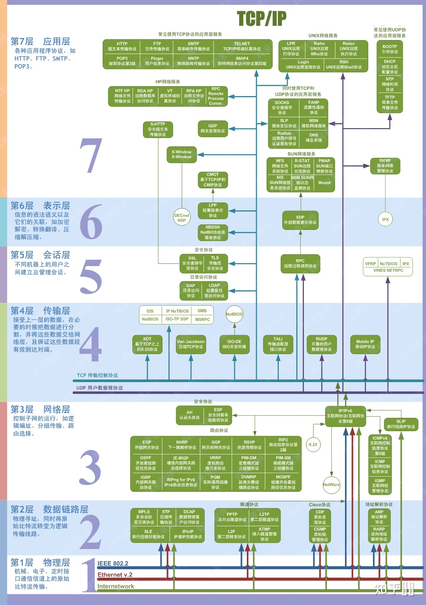
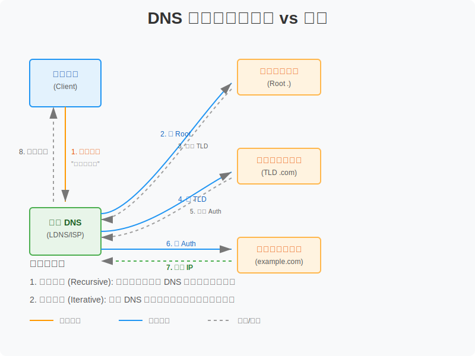
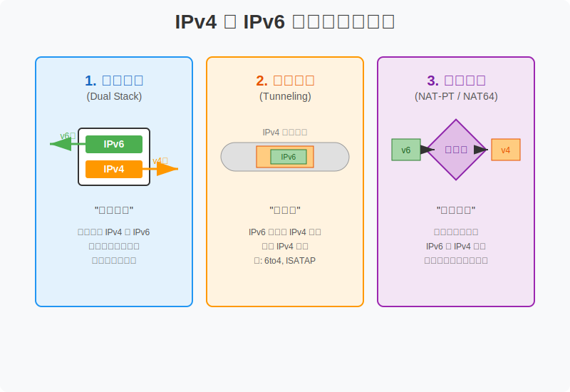
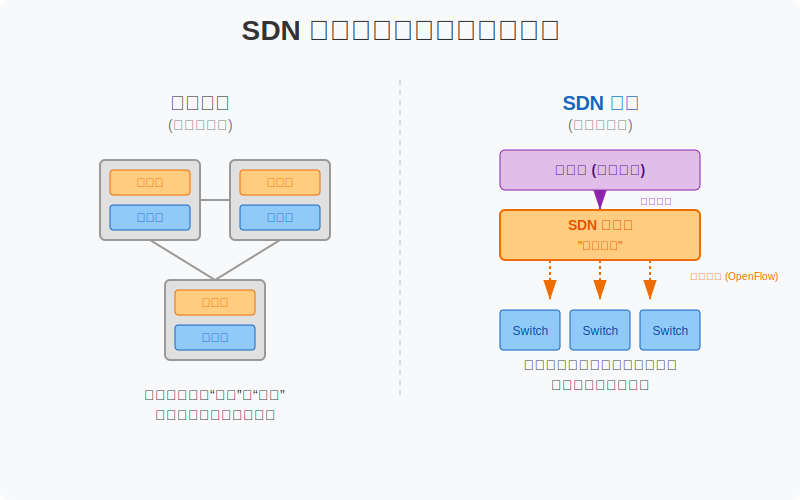

# 计算机网络基础

## OSI七层模型

OSI（Open Systems Interconnection）参考模型是国际标准化组织（ISO）制定的一个用于计算机或通信系统间互联的标准体系，一般称为OSI参考模型或七层模型。它将计算机网络体系结构划分为七层，自下而上依次为：物理层、数据链路层、网络层、传输层、会话层、表示层、应用层。

### 一、各层详解

#### 1. 物理层 (Physical Layer)
- **功能**：利用传输介质为数据链路层提供物理连接，实现比特流的透明传输。
- **数据单位**：比特 (Bit)
- **典型设备**：中继器 (Repeater)、集线器 (Hub)、网线、光纤
- **典型协议**：EIA-232, RJ-45, V.35

#### 2. 数据链路层 (Data Link Layer)
- **功能**：在物理层提供的比特流基础上，通过差错控制、流量控制方法，将有差错的物理线路变为无差错的数据链路。
- **数据单位**：帧 (Frame)
- **典型设备**：网桥 (Bridge)、交换机 (Switch)、网卡 (NIC)
- **典型协议**：Ethernet, PPP, HDLC, ARP/RARP, VLAN (802.1Q)

#### 3. 网络层 (Network Layer)
- **功能**：负责为分组交换网上的不同主机提供通信服务。主要任务是路由选择、分组转发、流量控制、拥塞控制。
- **数据单位**：数据包/分组 (Packet)
- **典型设备**：路由器 (Router)、三层交换机
- **典型协议**：IP (IPv4/IPv6), ICMP, IGMP, OSPF, BGP, RIP

#### 4. 传输层 (Transport Layer)
- **功能**：负责主机中两个进程之间的通信（端到端通信）。提供可靠（TCP）或不可靠（UDP）的数据传输服务，以及差错控制和流量控制。
- **数据单位**：数据段 (Segment) / 数据报 (Datagram)
- **典型协议**：TCP, UDP

#### 5. 会话层 (Session Layer)
- **功能**：负责建立、管理和终止表示层实体之间的通信会话。提供会话管理服务，如令牌管理、同步点设置。
- **典型协议**：RPC, SQL, NFS

#### 6. 表示层 (Presentation Layer)
- **功能**：处理两个通信系统中交换信息的表示方式。主要包括数据格式转换、数据加密/解密、数据压缩/解压。
- **典型协议**：JPEG, MPEG, ASCII, EBCDIC, SSL/TLS

#### 7. 应用层 (Application Layer)
- **功能**：直接为用户的应用进程提供服务，是用户与网络的接口。
- **典型协议**：HTTP, FTP, SMTP, DNS, Telnet, SSH

### 二、OSI七层模型汇总表

| 层级 | 名称 | 功能关键词 | PDU (协议数据单元) | 典型设备 | 典型协议 |
| :--- | :--- | :--- | :--- | :--- | :--- |
| 7 | 应用层 | 网络服务接口 | 数据 | 计算机/网关 | HTTP, FTP, SMTP |
| 6 | 表示层 | 格式/加密/压缩 | 数据 | 网关 | JPEG, ASCII |
| 5 | 会话层 | 会话管理 | 数据 | 网关 | RPC, NFS |
| 4 | 传输层 | 端到端/可靠性 | 段 (Segment) | 网关/防火墙 | TCP, UDP |
| 3 | 网络层 | 路由/寻址 | 包 (Packet) | 路由器 | IP, ICMP |
| 2 | 数据链路层 | 帧同步/MAC | 帧 (Frame) | 交换机/网桥 | Ethernet, ARP |
| 1 | 物理层 | 比特流传输 | 比特 (Bit) | 集线器/中继器 | RJ-45 |

### 三、记忆口诀
- **应表会传网链物**（自上而下）：应用层、表示层、会话层、传输层、网络层、数据链路层、物理层。
- **All People Seem To Need Data Processing** (自上而下)：Application, Presentation, Session, Transport, Network, Data Link, Physical.
- **Please Do Not Throw Sausage Pizza Away** (自下而上)：Physical, Data Link, Network, Transport, Session, Presentation, Application.

## DNS 查询规则

DNS (Domain Name System) 是互联网的电话簿，它将人类可读的域名 (如 `www.example.com`) 转换为机器可读的 IP 地址 (如 `192.0.2.1`)。

### 一、基本概念与流程

DNS 查询通常涉及两种模式：**递归查询** (Recursive Query) 和 **迭代查询** (Iterative Query)。

*   **递归查询 (用户 -> 本地DNS)**：用户主机向本地 DNS 服务器发起请求：“请帮我查到这个域名的 IP，我只要结果。”本地 DNS 服务器必须负责到底，返回最终 IP 或错误。
*   **迭代查询 (本地DNS -> 根/顶级/权威)**：本地 DNS 服务器向根域名服务器发起请求：“请问 .com 归谁管？”根回复：“去找 .com 顶级域服务器 (TLD)”。本地 DNS 再去问 TLD，以此类推，直到找到权威服务器。

#### 详细查询步骤：
1.  **本地 Hosts 检查**：操作系统首先检查本地 Hosts 文件。
2.  **本地 DNS 缓存**：检查本地 DNS 客户端缓存。
3.  **发送递归请求**：若未命中，向配置的 **本地 DNS 服务器 (LDNS)** 发送请求。
4.  **LDNS 迭代查询**：
    *   LDNS 问 **根域名服务器 (.)** -> 获得 TLD 服务器地址。
    *   LDNS 问 **顶级域名服务器 (.com)** -> 获得权威服务器地址。
    *   LDNS 问 **权威域名服务器 (example.com)** -> 获得最终 IP。
5.  **缓存并返回**：LDNS 将结果缓存（根据 TTL），并将 IP 返回给用户。

### 二、常见 DNS 记录类型

| 类型 | 名称 | 作用 | 示例 |
| :--- | :--- | :--- | :--- |
| **A** | Address | 将域名指向 IPv4 地址 | `example.com -> 1.2.3.4` |
| **AAAA** | IPv6 Address | 将域名指向 IPv6 地址 | `example.com -> 2001:db8::1` |
| **CNAME** | Canonical Name | 别名记录，指向另一个域名 | `www.example.com -> example.com` |
| **MX** | Mail Exchange | 邮件交换记录，指定邮件服务器 | `example.com -> mail.example.com` |
| **NS** | Name Server | 指定该域名的权威 DNS 服务器 | `example.com -> ns1.example.com` |
| **TXT** | Text | 文本记录，常用于 SPF 反垃圾邮件验证 | `v=spf1 include:_spf.google.com ~all` |
| **PTR** | Pointer | 反向解析，将 IP 指向域名 | `1.2.3.4 -> example.com` |

### 三、常见问题与解决方法

1.  **DNS 解析慢**
    *   **原因**：本地 DNS 服务器响应慢，或递归查询链路过长。
    *   **解决**：更换公共 DNS (如 114.114.114.114, 8.8.8.8, 223.5.5.5)；减少 CNAME 链长度。

2.  **DNS 缓存中毒 (DNS Spoofing)**
    *   **原因**：攻击者向 DNS 缓存服务器注入虚假记录。
    *   **解决**：使用 **DNSSEC** (DNS Security Extensions) 对记录进行数字签名验证；使用 HTTPS (DoH) 或 TLS (DoT) 加密 DNS 查询。

3.  **修改 Hosts 不生效**
    *   **原因**：浏览器缓存或系统 DNS 缓存未刷新。
    *   **解决**：
        *   Windows: `ipconfig /flushdns`
        *   macOS: `sudo killall -HUP mDNSResponder`
        *   Chrome: `chrome://net-internals/#dns` -> Clear host cache

> **Tags**: #DNS #域名解析 #递归查询 #迭代查询 #计算机网络

## IPv4 与 IPv6 及其过渡技术

IPv6 (Internet Protocol version 6) 是为了解决 IPv4 地址耗尽问题而设计的下一代互联网协议。

### 一、IPv4 与 IPv6 核心区别

| 特性 | IPv4 | IPv6 |
| :--- | :--- | :--- |
| **地址长度** | 32位 (4字节)，约43亿个地址 | 128位 (16字节)，号称“给地球每粒沙子分配一个IP” |
| **地址表示** | 点分十进制 (如 `192.168.1.1`) | 冒号十六进制 (如 `2001:db8::1`) |
| **报文头** | 变长 (20-60字节)，包含校验和 | 定长 (40字节)，取消校验和，处理更高效 |
| **配置方式** | 手动配置或 DHCP | 即插即用 (SLAAC) 或 DHCPv6 |
| **安全性** | IPSec 是可选扩展 | IPSec 是协议标配 |
| **广播** | 支持广播 (Broadcast) | 取消广播，用组播 (Multicast) 和任播 (Anycast) 代替 |

### 二、IPv4 向 IPv6 的过渡技术

由于互联网无法一夜之间切换到 IPv6，因此需要过渡技术来实现共存和互通。主要有三种策略：

#### 1. 双协议栈 (Dual Stack)
*   **原理**：网络设备（如路由器、计算机）**同时运行 IPv4 和 IPv6 两套协议栈**。
*   **特点**：
    *   **最彻底**的解决方案，直接支持两种协议。
    *   如果目标地址是 IPv4，就走 IPv4 栈；是 IPv6，就走 IPv6 栈。
    *   **缺点**：所有设备都需要升级，成本较高，且每个节点仍需要消耗一个 IPv4 地址。

#### 2. 隧道技术 (Tunneling)
*   **原理**：**“搭便车”**。将 IPv6 数据报**封装**在 IPv4 数据报的数据部分中，穿越现有的 IPv4 网络。
*   **场景**：两个 IPv6 孤岛通过 IPv4 网络连接。
*   **常见协议**：
    *   **6to4**：自动建立隧道。
    *   **ISATAP**：站内自动隧道寻址协议。
    *   **GRE**：通用路由封装。
*   **缺点**：增加了报文开销，可能面临 MTU 问题。

#### 3. 地址转换 (Translation / NAT-PT)
*   **原理**：**“翻译官”**。网关设备在 IPv4 和 IPv6 网络边界，将报文头进行**格式转换**。
*   **场景**：纯 IPv4 主机与纯 IPv6 主机通信。
*   **常见协议**：NAT-PT (已废弃), **NAT64** (主流)。
*   **缺点**：破坏了端到端通信原则，增加了网关处理负担和延迟。

> **Tags**: #IPv4 #IPv6 #双协议栈 #隧道技术 #NAT64 #计算机网络

## DHCP 协议工作流程

DHCP (Dynamic Host Configuration Protocol) 即动态主机配置协议，用于自动为网络设备分配 IP 地址、子网掩码、网关和 DNS 服务器等信息。它基于 **UDP** 协议，服务器监听端口 **67**，客户端监听端口 **68**。

### 一、DORA 四步交互流程

DHCP 的工作流程通常被称为 **DORA** (Discover, Offer, Request, Acknowledge)。

1.  **Discover (发现)**
    *   **动作**：客户端广播发送 `DHCP Discover` 报文。
    *   **目的**：“有没有 DHCP 服务器在？我需要一个 IP。”
    *   **源IP**：0.0.0.0（因为还没IP）
    *   **目的IP**：255.255.255.255（广播）

2.  **Offer (提供)**
    *   **动作**：网络中的 DHCP 服务器收到发现报文后，从地址池中选一个未用的 IP，广播（或单播）发送 `DHCP Offer` 报文。
    *   **目的**：“我是服务器 A，我可以给你提供 IP 192.168.1.10。”

3.  **Request (请求)**
    *   **动作**：客户端可能会收到多个 Offer，通常选择最先到达的那个，然后**广播**发送 `DHCP Request` 报文。
    *   **目的**：“我决定选用服务器 A 给我的 IP 192.168.1.10。”
    *   **关键点**：**为什么要广播？** 为了通知**其他**发送了 Offer 的服务器（如服务器 B、C），我已经名花有主了，你们可以把预留给我的 IP 释放给别人用了。

4.  **Ack (确认)**
    *   **动作**：被选中的服务器收到 Request 后，广播（或单播）发送 `DHCP Ack` 报文。
    *   **目的**：“好的，确认这个 IP 归你使用了，租期为 8 天。”
    *   **结果**：客户端收到 Ack 后，配置 IP，开始上网。

### 二、租约续期 (Renewal)

客户端不会一直占用 IP，通常有租期（Lease Time）。

*   **T1 (50% 租期)**：客户端向服务器发送**单播** Request，请求续约。
    *   如果服务器回复 Ack，租期延长。
*   **T2 (87.5% 租期)**：如果 T1 时刻服务器没理（比如服务器挂了），客户端会在 T2 时刻发送**广播** Request，看有没有其他服务器能帮忙续约或重新分配。
*   **100% 租期**：如果还没成功，IP 失效，客户端必须停止使用该 IP，并重新开始 Discover 过程。

> **Tags**: #DHCP #DORA #网络协议 #计算机网络

## SDN 网络 (Software Defined Networking)

SDN（软件定义网络）是一种新型的网络架构，其核心思想是将网络的**控制层**（Control Plane）与**数据转发层**（Data Plane）分离，通过集中式的控制器来管理网络设备，从而实现网络流量的灵活控制和编程。

### 一、核心架构：转控分离

传统网络设备（如路由器、交换机）是“**大脑与肌肉合体**”的，每个设备都有自己的控制逻辑和转发硬件。SDN 则将“大脑”抽离出来，形成一个集中的控制器，底层设备只保留“肌肉”负责转发。

SDN 架构通常分为三层：

1.  **应用层 (Application Layer)**：
    *   **位置**：最顶层。
    *   **功能**：各种网络应用，如负载均衡、防火墙、网络监控等业务逻辑。
    *   **接口**：通过**北向接口** (Northbound Interface) 与控制器通信。

2.  **控制层 (Control Layer)**：
    *   **位置**：中间层，SDN 的核心。
    *   **功能**：**SDN 控制器** (Controller)。它是网络的“超级大脑”，掌握全局网络视图，负责制定转发规则并下发给底层设备。
    *   **接口**：
        *   向上通过北向接口服务应用层。
        *   向下通过**南向接口** (Southbound Interface) 控制基础设施层。

3.  **基础设施层 (Infrastructure Layer)**：
    *   **位置**：最底层。
    *   **功能**：数据转发设备（SDN 交换机）。它们是“哑巴”设备，只负责根据控制器下发的流表 (Flow Table) 进行数据包的转发、丢弃或修改。
    *   **关键协议**：**OpenFlow** 是最常用的南向接口协议。

### 二、SDN 的优势与挑战

| 维度 | 传统网络 | SDN 网络 |
| :--- | :--- | :--- |
| **控制方式** | 分布式控制，每个设备独立决策 | **集中式控制**，全局统一调度 |
| **配置管理** | 需逐台登录设备配置 (CLI)，繁琐且易错 | 通过控制器**编程自动化**配置，灵活高效 |
| **灵活性** | 硬件与功能绑定，扩展新功能难 | **软硬件解耦**，功能由软件定义，升级容易 |
| **运维成本** | 高，排查问题依赖人工经验 | 低，可视化管理，自动化运维 |
| **单点故障** | 无（设备坏了只影响局部） | **控制器是单点**，需高可用集群保障 |

### 三、关键技术与协议

*   **OpenFlow**：SDN 的标志性协议，定义了控制器与交换机之间的通信标准。控制器通过 OpenFlow 通道向交换机下发**流表 (Flow Table)**。
*   **流表 (Flow Table)**：SDN 交换机的转发表。每条流表项包含：
    *   **匹配域 (Match Fields)**：如源 IP、目的 IP、端口号等。
    *   **指令 (Instructions)**：如转发到某端口、丢弃、修改包头等。
    *   **计数器 (Counters)**：统计匹配的数据包数量。

### 四、SDN 关键技术详解

#### 1. 控制平面技术 (Control Plane)
控制平面是 SDN 的大脑，核心组件是**SDN控制器**。
*   **集中式控制**：控制器拥有全局网络视图（Global Network View），能够基于全网拓扑计算最优路径。
*   **编程接口**：提供北向接口（如 REST API）供上层应用调用，实现网络业务的快速部署。
*   **高可用性**：为避免单点故障，控制器通常采用**集群**（Cluster）部署，通过分布式一致性算法（如 Raft, Paxos）保持状态同步。

#### 2. 数据平面技术 (Data Plane)
数据平面是 SDN 的肌肉，核心组件是**SDN交换机**。
*   **通用转发硬件**：不再依赖专有 ASIC 芯片，可以使用通用的商用芯片（Merchant Silicon）。
*   **流表处理**：交换机内部维护一个或多个流表（Flow Table）。
    *   **流水线处理 (Pipeline Processing)**：数据包可以依次经过多个流表进行处理（如先查 VLAN 表，再查 MAC 表，最后查 IP 表）。
*   **指令集**：支持丰富的动作，如 `Forward`（转发）、`Drop`（丢弃）、`Modify`（修改包头）、`Encapsulate`（封装隧道）等。

#### 3. 转发规则一致性更新技术 (Consistency Update)

在 SDN 中，控制器需要频繁向多台交换机下发新的流表规则。如果更新过程不同步，可能会导致网络中存在**新旧规则共存**的中间状态，从而引发**转发环路 (Loop)**、**黑洞 (Blackhole)** 或**安全策略失效**等问题。

为了解决这个问题，通常采用 **二阶段提交 (Two-Phase Commit)** 或 **版本号机制**：

*   **阶段一：预提交 (Pre-commit)**
    *   控制器将带有**新版本号 (Version N+1)** 的流表规则下发给所有相关交换机。
    *   交换机将新规则存入缓存，但**暂不生效**，继续使用旧规则 (Version N) 转发数据。
    *   交换机向控制器反馈“准备就绪”。

*   **阶段二：提交生效 (Commit)**
    *   当控制器收到所有交换机的确认后，发送“提交”指令。
    *   所有交换机**原子性**地切换到新版本规则。
    *   **数据包标记**：实际上，常通过给数据包打上版本标签（Tag），让带有旧标签的包走旧规则，新标签的包走新规则，实现平滑过渡（每包一致性）。

> **Tags**: #SDN #软件定义网络 #OpenFlow #转控分离 #计算机网络

## 局域网的三层设计模型

在构建大型局域网（Campus LAN）时，为了保证网络的高可用性、可扩展性和易管理性，通常采用经典的**分层设计模型**。该模型将网络划分为三个逻辑层次：**核心层**、**汇聚层**和**接入层**。

### 一、各层功能详解

#### 1. 接入层 (Access Layer)
*   **定位**：网络的边缘，直接连接用户设备（PC、打印机、AP等）。
*   **主要功能**：
    *   **用户接入**：提供高密度的端口接入。
    *   **安全控制**：实施端口安全（Port Security）、802.1X 认证，防止非法设备接入。
    *   **广播域隔离**：通过划分 VLAN，将不同的部门或业务隔离开。
    *   **二层交换**：主要进行 MAC 地址表转发。
*   **典型设备**：二层交换机（Layer 2 Switch）。

#### 2. 汇聚层 (Aggregation / Distribution Layer)
*   **定位**：接入层和核心层的“中间人”，网络的边界。
*   **主要功能**：
    *   **策略实施**：定义访问控制列表 (ACL)、QoS (服务质量) 策略，控制谁能访问谁，谁的流量优先。
    *   **VLAN 间路由**：实现不同 VLAN 之间的通信（作为默认网关）。
    *   **广播域终结**：广播包到此为止，不再向上传播到核心层。
    *   **地址聚合**：汇聚路由信息，减轻核心层路由表负担。
*   **典型设备**：三层交换机（Layer 3 Switch）。

#### 3. 核心层 (Core Layer)
*   **定位**：网络的骨干高速公路。
*   **主要功能**：
    *   **高速转发**：以最快的速度交换数据包，通常不进行复杂的策略控制（如 ACL），以免影响性能。
    *   **可靠性与冗余**：要求极高的可靠性，通常采用双机热备、链路聚合等技术，确保主干网络永不掉线。
*   **典型设备**：高性能核心交换机、高端路由器。

### 二、设计原则

1.  **层次化**：每层功能单一明确，便于排错和扩容。
2.  **冗余性**：汇聚层和核心层之间、汇聚层设备之间通常采用全互联或双链路设计，避免单点故障。
3.  **收敛性**：核心层应具备快速收敛能力，当网络拓扑发生变化时能迅速恢复。

> **Tags**: #网络设计 #三层架构 #核心层 #汇聚层 #接入层 #计算机网络

## 数据通信基本原理

### 信道容量与数据速率

在数据通信中，信道容量和数据速率是两个基本概念，它们分别由香农理论和奈奎斯特定理描述。

#### 奈奎斯特定理（Nyquist Theorem）

奈奎斯特定理描述了在理想无噪声环境下，信道的最大数据传输速率：

**B = 2W**

其中：
- B：码元速度，单位为波特(Baud)
- W：信道带宽，单位为赫兹(Hz)

奈奎斯特定理表明，在理想条件下，信道的码元传输速率最大为带宽的两倍。

#### 数据速率计算

数据速率R与码元速度B的关系：

**R = B log₂N**

其中：
- R：数据速率，单位为比特/秒(bps)
- B：码元速度，单位为波特(Baud)
- N：码元种类数，由调制技术决定

#### 香农理论（Shannon Theory）

香农理论考虑了噪声对信道容量的影响，给出了有噪声信道的极限数据速率：

**C = W log₂(1+S/N)**

其中：
- C：信道的极限数据速率，单位为比特/秒(bps)
- W：信道带宽，单位为赫兹(Hz)
- S：信号平均功率
- N：噪声平均功率
- S/N：信噪比

### 数据通信系统模型

数据通信系统主要包含以下几个关键组件及其关系：

1. **带宽(W)**：信道可用的频率范围，直接影响码元速度
2. **噪声影响**：环境噪声降低信道容量，通过信噪比(S/N)表示
3. **码元速度(B)**：由奈奎斯特定理确定，B = 2W
4. **调制技术**：决定码元种类数(N)
5. **数据速率(R)**：最终的比特传输速率，R = B log₂N

### 实际应用

在实际通信系统设计中：
- 增加带宽(W)可以提高码元速度
- 改进调制技术可以增加码元种类数(N)
- 降低噪声或提高信号功率可以提高信噪比(S/N)

这些措施都可以提高数据传输速率，但都受到物理和技术条件的限制。

# 网络连接中的半连接和已完成连接

> `半连接`：服务端收到客户端`syn`后,将连接放入半连接队列。如果半连接队列已满会丢弃，客户端报错`connection time out`
> 
> `已完成连接`：服务端收到客户端的`ack`后，从半连接队列中拿出连接放入已完成连接队列。如果已完成连接队列已经满则无法放入，客户端报错`read timeout` 或者 `connection reset by peer`
> 
> `syn:`SYN是TCP/IP建立连接时使用的握手信号。在客户机和服务器之间建立正常的TCP网络连接时，客户机首先发出一个SYN消息，服务器使用SYN+ACK应答表示接收到了这个消息，最后客户机再以ACK消息响应。这样在客户机和服务器之间才能建立起可靠的TCP连接，数据才可以在客户机和服务器之间传递
> 
> `ack:`在TCP报文段中，字段ACK=1时，确认号字段才有效。TCP规定，在连接建立后所有传送的报文段都必须把ACK置1

## JDK和TLS协议的版本关系

###### TCP

在 `netstat` 命令的输出中，`TIME_WAIT` 是 TCP 连接状态之一。下面是一些常见的 TCP 连接状态以及它们的说明：

1. `ESTABLISHED`（已建立）：表示已经建立的 TCP 连接。数据可以在双方之间传输。

2. `SYN_SENT`（发送 SYN）：表示正在向远程主机发送连接请求（SYN）的状态。在双方建立连接之前，发送方会先发送 SYN 报文。

3. `SYN_RECEIVED`（接收 SYN）：表示正在等待远程主机的连接确认（SYN/ACK）的状态。接收方已经收到连接请求并发送了确认。

4. `FIN_WAIT1`（等待终止阶段1）：表示连接的一方发送了关闭连接请求（FIN）并等待对方的确认。此状态通常是在发送方先关闭连接时出现。

5. `FIN_WAIT2`（等待终止阶段2）：表示接收到对方的关闭连接请求（FIN），并已经发送了确认，但仍在等待对方发送关闭连接的确认。

6. `TIME_WAIT`（等待时间）：表示连接已经被关闭，但仍然保持在此状态的一段时间。在此期间，系统会保留连接的信息以处理可能滞后的数据包。

7. `CLOSE_WAIT`（等待关闭）：表示连接的一方已经发送了关闭连接请求（FIN），并等待对方的确认。这是接收方在接收到关闭请求后的状态。

8. `LAST_ACK`（最后确认）：表示连接的一方发送了关闭连接请求（FIN），并等待对方的确认。这是发送方在接收到对方的确认后的状态。

9. `LISTEN`（监听）：表示正在侦听传入连接请求的状态，通常用于服务器端等待连接的状态。

以上是一些常见的 TCP 连接状态，其中 `TIME_WAIT` 是一个特殊的状态，表示连接已经关闭但仍在等待一段时间，以确保所有相关的数据包都被处理完毕。这是为了防止旧的连接请求与新的连接请求混淆。

请注意，`netstat` 命令的输出可能因操作系统和版本的不同而略有差异，因此具体的连接状态可能会有所变化。可以使用 `netstat --help` 或 `man netstat` 命令来查看特定操作系统中 `netstat` 命令的帮助文档，以获取更详细的信息。

## 网络存储架构

在企业级存储中，随着数据量的爆炸式增长，传统的直接连接存储（DAS）已无法满足需求，网络化存储（NAS 和 SAN）成为主流。

### 常见架构对比

1.  **DAS (Direct Attached Storage)**
    *   **特点**：存储设备直接通过 SCSI/SAS 线缆连接到服务器。
    *   **访问方式**：**块级访问 (Block Level)**。
    *   **缺点**：扩展性差，资源无法共享，形成“信息孤岛”。

2.  **NAS (Network Attached Storage)**
    *   **特点**：即插即用的文件服务器，通过 LAN (Ethernet) 连接。
    *   **访问方式**：**文件级访问 (File Level)**，使用 NFS/CIFS 协议。
    *   **优点**：易于管理和共享文件。
    *   **缺点**：占用业务网络带宽，性能受限于 TCP/IP 协议栈开销。

3.  **SAN (Storage Area Network)**
    *   **特点**：专用的高速存储网络。通常指 FC-SAN（光纤通道）或 IP-SAN（iSCSI）。
    *   **访问方式**：**块级访问 (Block Level)**。
    *   **关键创新**：**业务网络与存储网络分离**。

### 重点题目解析

> **问题描述**：为了避免备份数据，或转移存储数据占用过高网络带宽从而影响业务系统正常运作，哪种存储架构首次采用了业务网络与存储网络分开的结构？

**解析**：

*   **SAN (Storage Area Network)** 是正确答案。
*   在 DAS 中，存储依赖于服务器，备份流量需经过服务器总线。
*   在 NAS 中，存储流量和业务流量共享同一个局域网（LAN），备份大数据量时会严重抢占业务带宽。
*   **SAN 的核心设计思想**就是建立一个**独立于业务局域网之外的专用高速存储网络**（通常是光纤通道 FC 或专用 IP 网络）。这样，数据备份、迁移等高吞吐量的操作都在专用的 SAN 网络中进行，**完全不占用业务网络（LAN）的带宽**，从而保证了业务系统的正常运作。

### 总结

| 特性 | DAS | NAS | SAN |
| :--- | :--- | :--- | :--- |
| **全称** | Direct Attached Storage | Network Attached Storage | Storage Area Network |
| **连接方式** | 总线直连 (SCSI/SAS) | 局域网 (LAN) | **专用存储网** (FC/IP) |
| **传输对象** | **块 (Block)** | **文件 (File)** | **块 (Block)** |
| **主要协议** | SCSI | NFS, CIFS/SMB | FC, iSCSI |
| **带宽占用** | 占用服务器总线 | **占用业务网络** | **独立网络，不占业务带宽** |
| **适用场景** | 单机小规模 | 文件共享、办公协作 | 关键业务数据库、集中备份 |

## 标签
#计算机网络 #数据通信 #香农理论 #奈奎斯特定理 #信道容量 #带宽 #网络存储 #SAN #NAS #DAS

